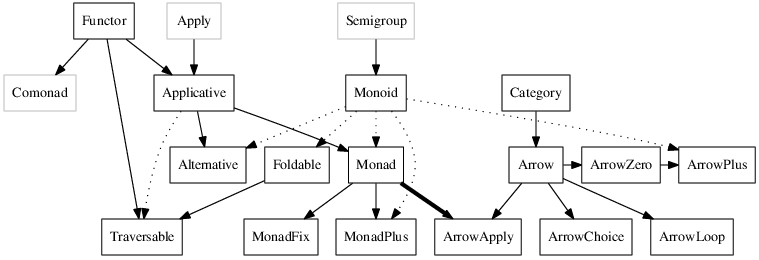

% Typeclassopedia
% Brent Yorgey

Originally published 12 March 2009 in [issue 13](http://www.haskell.org/wikiupload/8/85/TMR-Issue13.pdf) of [the Monad.Reader](http://themonadreader.wordpress.com/). Ported to the Haskell wiki in November 2011 by Geheimdienst. Converted to Markdown in August 2013 by Erlend Hamberg. Converted to EPUB format with [pandoc](http://www.pandoc.org).

*This is not the official version of the Typeclassopedia. The official version is now the [Haskell wiki version](http://www.haskell.org/haskellwiki/Talk:Typeclassopedia) which supersedes the version published in the Monad.Reader.  Please help update and extend it by editing it yourself or by leaving comments, suggestions, and questions on the [talk page](http://www.haskell.org/haskellwiki/Talk:Typeclassopedia).*

# Abstract

The standard Haskell libraries feature a number of type classes with algebraic or category-theoretic underpinnings. Becoming a fluent Haskell hacker requires intimate familiarity with them all, yet acquiring this familiarity often involves combing through a mountain of tutorials, blog posts, mailing list archives, and IRC logs.

The goal of this document is to serve as a starting point for the student of Haskell wishing to gain a firm grasp of its standard type classes. The essentials of each type class are introduced, with examples, commentary, and extensive references for further reading.

# Introduction

Have you ever had any of the following thoughts?

* What the heck is a monoid, and how is it different from a mon**a**d?
* I finally figured out how to use [Parsec](http://www.haskell.org/haskellwiki/Parsec) with do-notation, and someone told me I should use something called `Applicative`{.haskell} instead. Um, what?
* Someone in the [IRC channel](irc://chat.freenode.net/haskell) IRC channel used `(***)`{.haskell}, and when I asked lambdabot to tell me its type, it printed out scary gobbledygook that didn’t even fit on one line! Then someone used `fmap fmap fmap`{.haskell} and my brain exploded.
* When I asked how to do something I thought was really complicated, people started typing things like `zip.ap fmap.(id &&& wtf)`{.haskell} and the scary thing is that they worked! Anyway, I think those people must actually be robots because there’s no way anyone could come up with that in two seconds off the top of their head.

If you have, look no further! You, too, can write and understand concise, elegant, idiomatic Haskell code with the best of them.

There are two keys to an expert Haskell hacker’s wisdom:

#. Understand the types.
#. Gain a deep intuition for each type class and its relationship to other type classes, backed up by familiarity with many examples.

It’s impossible to overstate the importance of the first; the patient student of type signatures will uncover many profound secrets. Conversely, anyone ignorant of the types in their code is doomed to eternal uncertainty. “Hmm, it doesn’t compile ... maybe I’ll stick in an
`fmap`{.haskell} here ... nope, let’s see ... maybe I need another `(.)`{.haskell} somewhere? ... um ...”

The second key---gaining deep intuition, backed by examples---is also important, but much more difficult to attain. A primary goal of this document is to set you on the road to gaining such intuition. However---

> *There is no royal road to Haskell.* --Euclid ^[Well, he probably would have said it if he knew Haskell.]

This document can only be a starting point, since good intuition comes from hard work, [not from learning the right metaphor](http://byorgey.wordpress.com/2009/01/12/abstraction-intuition-and-the-monad-tutorial-fallacy/). Anyone who reads and understands all of it will still have an arduous journey ahead---but sometimes a good starting point makes a big difference.

It should be noted that this is not a Haskell tutorial; it is assumed that the reader is already familiar with the basics of Haskell, including the standard [`Prelude`](http://haskell.org/ghc/docs/latest/html/libraries/base/Prelude.html), the type system, data types, and type classes.

The type classes we will be discussing and their interrelationships:



* <span style="border-bottom: 2px solid black">Solid arrows</span> point from the general to the specific; that is, if there is an arrow from `Foo`{.haskell} to `Bar`{.haskell} it means that every `Bar`{.haskell} is (or should be, or can be made into) a `Foo`{.haskell}.
* <span style="border-bottom: 2px dotted black">Dotted arrows</span> indicate some other sort of relationship.
* `Monad`{.haskell} and `ArrowApply`{.haskell} are equivalent.
* `Semigroup`{.haskell}, `Apply`{.haskell} and `Comonad`{.haskell} are greyed out since they are not actually (yet?) in the standard Haskell libraries ^[`Semigroup`{.haskell} can be found in the [`semigroups` package](http://hackage.haskell.org/package/semigroups), `Apply`{.haskell} in the [`semigroupoids` package](http://hackage.haskell.org/package/semigroupoids), and `Comonad`{.haskell} in the [`comonad` package](http://hackage.haskell.org/package/comonad).]

One more note before we begin. The original spelling of “type class” is with two words, as evidenced by, for example, the [Haskell 98 Revised Report](http://haskell.org/onlinereport/), early papers on type classes like [Type classes in Haskell](http://citeseer.ist.psu.edu/viewdoc/summary?doi=10.1.1.103.5639) and [Type classes: exploring the design space](http://research.microsoft.com/en-us/um/people/simonpj/papers/type-class-design-space/), and [Hudak et al.’s history of Haskell](http://citeseer.ist.psu.edu/viewdoc/summary?doi=10.1.1.168.4008).  However, as often happens with two-word phrases that see a lot of use, it has started to show up as one word (“typeclass”) or, rarely, hyphenated (“type-class”).  When wearing my prescriptivist hat, I prefer “type class”, but realize (after changing into my descriptivist hat) that there's probably not much I can do about it.

We now begin with the simplest type class of all: `Functor`{.haskell}.

# Functor

The `Functor`{.haskell} class ([haddock](http://haskell.org/ghc/docs/latest/html/libraries/base/Prelude.html#t:Functor)) is the most basic and ubiquitous type class in the Haskell libraries. A simple intuition is that a `Functor`{.haskell} represents a “container” of some sort, along with the ability to apply a function uniformly to every element in the container. For example, a list is a container of elements, and we can apply a function to every element of a list, using `map`{.haskell}. As another example, a binary tree is also a container of elements, and it’s not hard to come up with a way to recursively apply a function to every element in a tree.

Another intuition is that a `Functor`{.haskell} represents some sort of “computational context”. This intuition is generally more useful, but is more difficult to explain, precisely because it is so general. Some examples later should help to clarify the `Functor`{.haskell}-as-context point of view.

In the end, however, a `Functor`{.haskell} is simply what it is defined to be; doubtless there are many examples of `Functor`{.haskell} instances that don’t exactly fit either of the above intuitions. The wise student will focus their attention on definitions and examples, without leaning too heavily on any particular metaphor. Intuition will come, in time, on its own.

## Definition

Here is the type class declaration for `Functor`{.haskell}:

```haskell
class Functor f where
  fmap :: (a -> b) -> f a -> f b
```

`Functor`{.haskell} is exported by the `Prelude`{.haskell}, so no special imports are needed to use it.

First, the `f a`{.haskell} and `f b`{.haskell} in the type signature for `fmap`{.haskell} tell us that `f` isn’t just a type; it is a *type constructor* which takes another type as a parameter. (A more precise way to say this is that the *kind* of `f` must be `* -> *`{.haskell}.) For example, `Maybe`{.haskell} is such a type constructor: `Maybe`{.haskell} is not a type in and of itself, but requires another type as a parameter, like `Maybe Integer`{.haskell}. So it would not make sense to say `instance Functor Integer`{.haskell}, but it could make sense to say `instance Functor Maybe`{.haskell}.

Now look at the type of `fmap`{.haskell}: it takes any function from `a` to `b`, and a value of type `f a`{.haskell}, and outputs a value of type `f b`{.haskell}. From the container point of view, the intention is that `fmap`{.haskell} applies a function to each element of a container, without altering the structure of the container. From the context point of view, the intention is that `fmap`{.haskell} applies a function to a value without altering its context. Let’s look at a few specific examples.

## Instances

As noted before, the list constructor `[]`{.haskell} is a functor ^[Recall that `[]`{.haskell} has two meanings in Haskell: it can either stand for the empty list, or, as here, it can represent the list type constructor (pronounced “list-of”). In other words, the type `[a]`{.haskell} (list-of-`a`) can also be written `[] a`{.haskell}.]; we can use the standard list function `map`{.haskell} to apply a function to each element of a list ^[You might ask why we need a separate `map`{.haskell} function. Why not just do away with the current list-only `map`{.haskell} function, and rename `fmap`{.haskell} to `map`{.haskell} instead? Well, that’s a good question. The usual argument is that someone just learning Haskell, when using `map`{.haskell} incorrectly, would much rather see an error about lists than about `Functor`{.haskell}s.]. The `Maybe`{.haskell} type constructor is also a functor, representing a container which might hold a single element. The function `fmap g`{.haskell} has no effect on `Nothing`{.haskell} (there are no elements to which `g` can be applied), and simply applies `g` to the single element inside a `Just`{.haskell}. Alternatively, under the context interpretation, the list functor represents a context of nondeterministic choice; that is, a list can be thought of as representing a single value which is nondeterministically chosen from among several possibilities (the elements of the list). Likewise, the `Maybe`{.haskell} functor represents a context with possible failure. These instances are:

```haskell
instance Functor [] where
  fmap _ []     = []
  fmap g (x:xs) = g x : fmap g xs
  -- or we could just say fmap = map

instance Functor Maybe where
  fmap _ Nothing  = Nothing
  fmap g (Just a) = Just (g a)
```

As an aside, in idiomatic Haskell code you will often see the letter `f` used to stand for both an arbitrary `Functor`{.haskell} and an arbitrary function. In this document, `f` represents only `Functor`{.haskell}s, and `g` or `h` always represent functions, but you should be aware of the potential confusion. In practice, what `f` stands for should always be clear from the context, by noting whether it is part of a type or part of the code.

There are other `Functor`{.haskell} instances in the standard libraries; below are a few. Note that some of these instances are not exported by the `Prelude`; to access them, you can import `Control.Monad.Instances`.

* `Either e`{.haskell} is an instance of `Functor`{.haskell}; `Either e a`{.haskell} represents a container which can contain either a value of type `a`, or a value of type `e` (often representing some sort of error condition). It is similar to `Maybe`{.haskell} in that it represents possible failure, but it can carry some extra information about the failure as well.

* `((,) e)`{.haskell} represents a container which holds an “annotation” of type `e` along with the actual value it holds. It might be clearer to write it as `(e,)`{.haskell}, by analogy with an operator section like `(1+)`{.haskell}, but that syntax is not allowed in types (although it is allowed in expressions with the `TupleSections`{.haskell} extension enabled). However, you can certainly *think* of it as `(e,)`{.haskell}.

* `((->) e)`{.haskell} (which can be thought of as `(e ->)`; see above), the type of functions which take a value of type `e` as a parameter, is a `Functor`{.haskell}.  As a container, `(e -> a)`{.haskell} represents a (possibly infinite) set of values of `a`, indexed by values of `e`. Alternatively, and more usefully, `((->) e)`{.haskell} can be thought of as a context in which a value of type `e` is available to be consulted in a read-only fashion. This is also why `((->) e)`{.haskell} is sometimes referred to as the *reader monad*; more on this later.

* `IO`{.haskell} is a `Functor`{.haskell}; a value of type `IO a`{.haskell} represents a computation producing a value of type `a` which may have I/O effects. If `m` computes the value `x` while producing some I/O effects, then `fmap g m`{.haskell} will compute the value `g x`{.haskell} while producing the same I/O effects.

* Many standard types from the [containers library](http://hackage.haskell.org/package/containers/) (such as `Tree`{.haskell}, `Map`{.haskell}, and `Sequence`{.haskell}) are instances of `Functor`{.haskell}. A notable exception is `Set`{.haskell}, which cannot be made a `Functor`{.haskell} in Haskell (although it is certainly a mathematical functor) since it requires an `Ord`{.haskell} constraint on its elements; `fmap`{.haskell} must be applicable to *any* types `a` and `b`. However, `Set`{.haskell} (and other similarly restricted data types) can be made an instance of a suitable generalization of `Functor`{.haskell}, either by [making `a` and `b` arguments to the `Functor`{.haskell} type class themselves](http://article.gmane.org/gmane.comp.lang.haskell.cafe/78052/), or by adding an [associated constraint](http://blog.omega-prime.co.uk/?p=127).

> **Exercises**
>
> #. Implement `Functor`{.haskell} instances for `Either e`{.haskell} and `((->) e)`{.haskell}.
> #. Implement `Functor`{.haskell} instances for `((,) e)`{.haskell} and for `Pair`{.haskell}, defined as `data Pair a = Pair a a`{.haskell}.  Explain their similarities and differences.
> #. Implement a `Functor`{.haskell} instance for the type `ITree`{.haskell}, defined as
>
>     ```haskell
>     data ITree a = Leaf (Int -> a)
>                  | Node [ITree a]
>     ```
>
> #. Give an example of a type of kind `* -> *`{.haskell} which cannot be made an instance of `Functor`{.haskell} (without using `undefined`{.haskell}).
> #. Is this statement true or false?
>
>     > The composition of two `Functor`{.haskell}s is also a `Functor`{.haskell}.
>
>     If false, give a counterexample; if true, prove it by exhibiting some appropriate Haskell code.

## Laws

As far as the Haskell language itself is concerned, the only requirement to be a `Functor`{.haskell} is an implementation of `fmap`{.haskell} with the proper type. Any sensible `Functor`{.haskell} instance, however, will also satisfy the *functor laws*, which are part of the definition of a mathematical functor. There are two:

```haskell
fmap id = id
fmap (g . h) = (fmap g) . (fmap h)
```

Together, these laws ensure that `fmap g`{.haskell} does not change the *structure* of a container, only the elements. Equivalently, and more simply, they ensure that `fmap g`{.haskell} changes a value without altering its context ^[Technically, these laws make `f` and `fmap`{.haskell} together an endofunctor on *Hask*, the category of Haskell types (ignoring [&perp;](http://www.haskell.org/haskellwiki/Bottom), which is a party pooper). See [Wikibook: Category theory](http://en.wikibooks.org/wiki/Haskell/Category_theory).].

The first law says that mapping the identity function over every item in a container has no effect. The second says that mapping a composition of two functions over every item in a container is the same as first mapping one function, and then mapping the other.

As an example, the following code is a “valid” instance of `Functor`{.haskell} (it typechecks), but it violates the functor laws. Do you see why?

```haskell
-- Evil Functor instance
instance Functor [] where
  fmap _ [] = []
  fmap g (x:xs) = g x : g x : fmap g xs
```

Any Haskeller worth their salt would reject this code as a gruesome abomination.

Unlike some other type classes we will encounter, a given type has at most one valid instance of `Functor`{.haskell}. This [can be proven](http://article.gmane.org/gmane.comp.lang.haskell.libraries/15384) via the [*free theorem*](http://homepages.inf.ed.ac.uk/wadler/topics/parametricity.html#free) for the type of `fmap`{.haskell}.  In fact, [GHC can automatically derive](http://byorgey.wordpress.com/2010/03/03/deriving-pleasure-from-ghc-6-12-1/) `Functor`{.haskell} instances for many data types.

A similar argument also shows that any `Functor`{.haskell} instance satisfying the first law (`fmap id = id`{.haskell}) will automatically satisfy the second law as well.  Practically, this means that only the first law needs to be checked (usually by a very straightforward induction) to ensure that a `Functor`{.haskell} instance is valid.

> **Exercises**
>
> #. Although it is not possible for a `Functor`{.haskell} instance to satisfy the first `Functor`{.haskell} law but not the second, the reverse is possible. Give an example of a (bogus) `Functor`{.haskell} instance which satisfies the second law but not the first.
> #. Which laws are violated by the evil `Functor`{.haskell} instance for list shown above: both laws, or the first law alone? Give specific counterexamples.

## Intuition

There are two fundamental ways to think about `fmap`{.haskell}. The first has already been mentioned: it takes two parameters, a function and a container, and applies the function “inside” the container, producing a new container. Alternately, we can think of `fmap`{.haskell} as applying a function to a value in a context (without altering the context).

Just like all other Haskell functions of “more than one parameter”, however, `fmap`{.haskell} is actually *curried*: it does not really take two parameters, but takes a single parameter and returns a function. For emphasis, we can write `fmap`{.haskell}’s type with extra parentheses: `fmap :: (a -> b) -> (f a -> f b)`{.haskell}. Written in this form, it is apparent that `fmap`{.haskell} transforms a “normal” function (`g :: a -> b`{.haskell}) into one which operates over containers/contexts (`fmap g :: f a -> f b`{.haskell}). This transformation is often referred to as a *lift*; `fmap`{.haskell} “lifts” a function from the “normal world” into the “`f` world”.

## Further reading

A good starting point for reading about the category theory behind the concept of a functor is the excellent [Haskell wikibook page on category theory](http://en.wikibooks.org/wiki/Haskell/Category_theory).

# Applicative

A somewhat newer addition to the pantheon of standard Haskell type classes, *applicative functors* represent an abstraction lying in between `Functor`{.haskell} and `Monad`{.haskell} in expressivity, first described by McBride and Paterson. The title of their classic paper, [Applicative Programming with Effects](http://www.soi.city.ac.uk/~ross/papers/Applicative.html), gives a hint at the intended intuition behind the [`Applicative`{.haskell}](http://haskell.org/ghc/docs/latest/html/libraries/base/Control-Applicative.html) type class. It encapsulates certain sorts of “effectful” computations in a functionally pure way, and encourages an “applicative” programming style. Exactly what these things mean will be seen later.

## Definition

Recall that `Functor`{.haskell} allows us to lift a “normal” function to a function on computational contexts. But `fmap`{.haskell} doesn’t allow us to apply a function which is itself in a context to a value in a context. `Applicative`{.haskell} gives us just such a tool, `(<*>)`{.haskell}. It also provides a method, `pure`{.haskell}, for embedding values in a default, “effect free” context.  Here is the type class declaration for `Applicative`{.haskell}, as defined in `Control.Applicative`:

```haskell
class Functor f => Applicative f where
  pure  :: a -> f a
  (<*>) :: f (a -> b) -> f a -> f b
```

Note that every `Applicative`{.haskell} must also be a `Functor`{.haskell}. In fact, as we will see, `fmap`{.haskell} can be implemented using the `Applicative`{.haskell} methods, so every `Applicative`{.haskell} is a functor whether we like it or not; the `Functor`{.haskell} constraint forces us to be honest.

As always, it’s crucial to understand the type signatures.  First, consider `(<*>)`: the best way of thinking about it comes from noting that the type of `(<*>)`{.haskell} is similar to the type of `($)`{.haskell} ^[Recall that `($)`{.haskell} is just function application: `f $ x = f x`{.haskell}.], but with everything enclosed in an `f`. In other words, `(<*>)`{.haskell} is just function application within a computational context. The type of `(<*>)`{.haskell} is also very similar to the type of `fmap`{.haskell}; the only difference is that the first parameter is `f (a -> b)`{.haskell}, a function in a context, instead of a “normal” function `(a -> b)`{.haskell}.

`pure`{.haskell} takes a value of any type `a`, and returns a context/container of type `f a`{.haskell}.  The intention is that `pure`{.haskell} creates some sort of “default” container or “effect free” context.  In fact, the behavior of `pure`{.haskell} is quite constrained by the laws it should satisfy in conjunction with `(<*>)`{.haskell}.  Usually, for a given implementation of `(<*>)`{.haskell} there is only one possible implementation of `pure`{.haskell}.

(Note that previous versions of the Typeclassopedia explained `pure`{.haskell} in terms of a type class `Pointed`{.haskell}, which can still be found in the [`pointed` package](http://hackage.haskell.org/package/pointed).  However, the current consensus is that `Pointed`{.haskell} is not very useful after all.  For a more detailed explanation, see [Why not Pointed?](http://www.haskell.org/haskellwiki/Why not Pointed%3F))

## Laws


Traditionally, there are four laws that `Applicative`{.haskell} instances should satisfy ^[See [haddock for Applicative](http://haskell.org/ghc/docs/latest/html/libraries/base/Control-Applicative.html) and [Applicative programming with effects](http://www.soi.city.ac.uk/~ross/papers/Applicative.html)].  In some sense, they are all concerned with making sure that `pure`{.haskell} deserves its name:

* The identity law:<br />`pure id <*> v = v`{.haskell}
* Homomorphism:<br />`pure f <*> pure x = pure (f x)`{.haskell}<br />Intuitively, applying a non-effectful function to a non-effectful argument in an effectful context is the same as just applying the function to the argument and then injecting the result into the context with `pure`{.haskell}.
* Interchange:<br />`u <*> pure y = pure ($ y) <*> u`{.haskell}<br />Intuitively, this says that when evaluating the application of an effectful function to a pure argument, the order in which we evaluate the function and its argument doesn't matter.
* Composition:<br />`u <*> (v <*> w) = pure (.) <*> u <*> v <*> w`{.haskell}<br />This one is the trickiest law to gain intuition for.  In some sense it is expressing a sort of associativity property of `(<*>)`{.haskell}.  The reader may wish to simply convince themselves  that this law is type-correct.

Considered as left-to-right rewrite rules, the homomorphism, interchange, and composition laws actually constitute an algorithm for transforming any expression using `pure`{.haskell} and `(<*>)`{.haskell} into a canonical form with only a single use of `pure`{.haskell} at the very beginning and only left-nested occurrences of `(<*>)`{.haskell}.  Composition allows reassociating `(<*>)`; interchange allows moving occurrences of `pure`{.haskell} leftwards; and homomorphism allows collapsing multiple adjacent occurrences of `pure`{.haskell} into one.

There is also a law specifying how `Applicative`{.haskell} should relate to `Functor`{.haskell}:

```haskell
fmap g x = pure g <*> x
```

It says that mapping a pure function `g` over a context `x` is the same as first injecting `g` into a context with `pure`{.haskell}, and then applying it to `x` with `(<*>)`{.haskell}. In other words, we can decompose `fmap`{.haskell} into two more atomic operations: injection into a context, and application within a context. The `Control.Applicative` module also defines `(<$>)`{.haskell} as a synonym for `fmap`{.haskell}, so the above law can also be expressed as:

`g <$> x = pure g <*> x`{.haskell}.

> **Exercises**
>
> #. (Tricky) One might imagine a variant of the interchange law that says something about applying a pure function to an effectful argument.  Using the above laws, prove that `pure f <*> x = pure (flip ($)) <*> x <*> pure f`{.haskell}

## Instances

Most of the standard types which are instances of `Functor`{.haskell} are also instances of `Applicative`{.haskell}.

`Maybe`{.haskell} can easily be made an instance of `Applicative`{.haskell}; writing such an instance is left as an exercise for the reader.

The list type constructor `[]`{.haskell} can actually be made an instance of `Applicative`{.haskell} in two ways; essentially, it comes down to whether we want to think of lists as ordered collections of elements, or as contexts representing multiple results of a nondeterministic computation (see Wadler’s [How to replace failure by a list of successes](http://www.springerlink.com/content/y7450255v2670167/)).

Let’s first consider the collection point of view.  Since there can only be one instance of a given type class for any particular type, one or both of the list instances of `Applicative`{.haskell} need to be defined for a `newtype`{.haskell} wrapper; as it happens, the nondeterministic computation instance is the default, and the collection instance is defined in terms of a `newtype`{.haskell} called `ZipList`{.haskell}. This instance is:

```haskell
newtype ZipList a = ZipList { getZipList :: [a] }

instance Applicative ZipList where
  pure = undefined   -- exercise
  (ZipList gs) <*> (ZipList xs) = ZipList (zipWith ($) gs xs)
```

To apply a list of functions to a list of inputs with `(<*>)`{.haskell}, we just match up the functions and inputs elementwise, and produce a list of the resulting outputs. In other words, we “zip” the lists together with function application, `($)`; hence the name `ZipList`{.haskell}.

The other `Applicative`{.haskell} instance for lists, based on the nondeterministic computation point of view, is:

```haskell
instance Applicative [] where
  pure x    = [x]
  gs <*> xs = [ g x | g <- gs, x <- xs ]
```

Instead of applying functions to inputs pairwise, we apply each function to all the inputs in turn, and collect all the results in a list.

Now we can write nondeterministic computations in a natural style. To add the numbers `3` and `4` deterministically, we can of course write `(+) 3 4`{.haskell}. But suppose instead of `3` we have a nondeterministic computation that might result in `2`, `3`, or `4`; then we can write

```haskell
  pure (+) <*> [2,3,4] <*> pure 4
```

or, more idiomatically,

```haskell
  (+) <$> [2,3,4] <*> pure 4.
```

There are several other `Applicative`{.haskell} instances as well:

* `IO`{.haskell} is an instance of `Applicative`{.haskell}, and behaves exactly as you would think: to execute `m1 <*> m2`{.haskell}, first `m1`{.haskell} is executed, resulting in a function `f`, then `m2`{.haskell} is executed, resulting in a value `x`, and finally the value `f x`{.haskell} is returned as the result of executing `m1 <*> m2`{.haskell}.

* `((,) a)`{.haskell} is an `Applicative`{.haskell}, as long as `a` is an instance of `Monoid`{.haskell} ([section Monoid](#monoid)). The `a` values are accumulated in parallel with the computation.

* The `Applicative`{.haskell} module defines the `Const`{.haskell} type constructor; a value of type `Const a b`{.haskell} simply contains an `a`. This is an instance of `Applicative`{.haskell} for any `Monoid a`{.haskell}; this instance becomes especially useful in conjunction with things like `Foldable`{.haskell} ([section Foldable](#foldable)).

* The `WrappedMonad`{.haskell} and `WrappedArrow`{.haskell} newtypes make any instances of `Monad`{.haskell} ([section Monad](#monad)) or `Arrow`{.haskell} ([section Arrow](#arrow)) respectively into instances of `Applicative`{.haskell}; as we will see when we study those type classes, both are strictly more expressive than `Applicative`{.haskell}, in the sense that the `Applicative`{.haskell} methods can be implemented in terms of their methods.

> **Exercises**
>
> #. Implement an instance of `Applicative`{.haskell} for `Maybe`{.haskell}.
> #. Determine the correct definition of `pure`{.haskell} for the `ZipList`{.haskell} instance of `Applicative`{.haskell}---there is only one implementation that satisfies the law relating `pure`{.haskell} and `(<*>)`{.haskell}.

## Intuition

McBride and Paterson’s paper introduces the notation $[[g \; x_1 \; x_2 \; \cdots \; x_n]]$ to denote function application in a computational context. If each $x_i\ $ has type $f \; t_i\ $ for some applicative functor $f\ $, and $g\ $ has type $t_1 \to t_2 \to \dots \to t_n \to t\ $, then the entire expression $[[g \; x_1 \; \cdots \; x_n]]$ has type $f \; t\ $. You can think of this as applying a function to multiple “effectful” arguments. In this sense, the double bracket notation is a generalization of `fmap`{.haskell}, which allows us to apply a function to a single argument in a context.

Why do we need `Applicative`{.haskell} to implement this generalization of `fmap`{.haskell}? Suppose we use `fmap`{.haskell} to apply `g` to the first parameter `x1`{.haskell}. Then we get something of type `f (t2 -> ... t)`{.haskell}, but now we are stuck: we can’t apply this function-in-a-context to the next argument with `fmap`{.haskell}. However, this is precisely what `(<*>)`{.haskell} allows us to do.

This suggests the proper translation of the idealized notation $[[g \; x_1 \; x_2 \; \cdots \; x_n]]$ into Haskell, namely

```haskell
  g <$> x1 <*> x2 <*> ... <*> xn,
```

recalling that `Control.Applicative` defines `(<$>)`{.haskell} as convenient infix shorthand for `fmap`{.haskell}. This is what is meant by an “applicative style”---effectful computations can still be described in terms of function application; the only difference is that we have to use the special operator `(<*>)`{.haskell} for application instead of simple juxtaposition.

Note that `pure`{.haskell} allows embedding “non-effectful” arguments in the middle of an idiomatic application, like

```haskell
  g <$> x1 <*> pure x2 <*> x3
```

which has type `f d`{.haskell}, given

```haskell
g  :: a -> b -> c -> d
x1 :: f a
x2 :: b
x3 :: f c
```

The double brackets are commonly known as “idiom brackets”, because they allow writing “idiomatic” function application, that is, function application that looks normal but has some special, non-standard meaning (determined by the particular instance of `Applicative`{.haskell} being used).  Idiom brackets are not supported by GHC, but they are supported by the [Strathclyde Haskell Enhancement](http://personal.cis.strath.ac.uk/~conor/pub/she/), a preprocessor which (among many other things) translates idiom brackets into standard uses of `(<$>)`{.haskell} and `(<*>)`{.haskell}.  This can result in much more readable code when making heavy use of `Applicative`{.haskell}.

## Alternative formulation

An alternative, equivalent formulation of `Applicative`{.haskell} is given by

```haskell
class Functor f => Monoidal f where
  unit :: f ()
  (**) :: f a -> f b -> f (a,b)
```

Intuitively, this states that a *monoidal* functor is one which has some sort of "default shape" and which supports some sort of "combining" operation.  `pure`{.haskell} and `(<*>)`{.haskell} are equivalent in power to `unit`{.haskell} and `(**)`{.haskell} (see the Exercises below).

Furthermore, to deserve the name "monoidal" (see the [section on Monoids](#monoid)), instances of `Monoidal`{.haskell} ought to satisfy the following laws, which seem much more straightforward than the traditional `Applicative`{.haskell} laws:

* Naturality^[Here `g *** h = \(x,y) -> (g x, h y)`{.haskell}.  See [Arrows](#arrow).]:<br />`fmap (g *** h) (u ** v) = fmap g u ** fmap h v`{.haskell}
* Left identity^[In this and the following laws, `≅`{.haskell} refers to *isomorphism* rather than equality.  In particular we consider `(x,()) ≅ x ≅ ((),x)`{.haskell} and `((x,y),z) ≅ (x,(y,z))`{.haskell}.]:<br />`unit ** v ≅ v`{.haskell}
* Right identity:<br />`u ** unit ≅ u`{.haskell}
* Associativity:<br />`u ** (v ** w) ≅ (u ** v) ** w`{.haskell}

These turn out to be equivalent to the usual `Applicative`{.haskell} laws.

Much of this section was taken from [a blog post by Edward Z. Yang](http://blog.ezyang.com/2012/08/applicative-functors/); see his actual post for a bit more information.

> **Exercises**
>
> #. Implement `pure`{.haskell} and `(<*>)`{.haskell} in terms of `unit`{.haskell} and `(**)`{.haskell}, and vice versa.
> #. (Tricky) Prove that given your implementations from the previous exercise, the usual `Applicative`{.haskell} laws and the `Monoidal`{.haskell} laws stated above are equivalent.

## Further reading

There are many other useful combinators in the standard libraries implemented in terms of `pure`{.haskell} and `(<*>)`: for example, `(*>)`{.haskell}, `(<*)`{.haskell}, `(<**>)`{.haskell}, `(<$)`{.haskell}, and so on (see [haddock for Applicative](http://haskell.org/ghc/docs/latest/html/libraries/base/Control-Applicative.html)). Judicious use of such secondary combinators can often make code using `Applicative`{.haskell}s much easier to read.

[McBride and Paterson’s original paper](http://www.soi.city.ac.uk/~ross/papers/Applicative.html) is a treasure-trove of information and examples, as well as some perspectives on the connection between `Applicative`{.haskell} and category theory. Beginners will find it difficult to make it through the entire paper, but it is extremely well-motivated---even beginners will be able to glean something from reading as far as they are able.

Conal Elliott has been one of the biggest proponents of `Applicative`{.haskell}. For example, the [Pan library for functional images](http://conal.net/papers/functional-images/) and the reactive library for functional reactive programming (FRP) ^[Introduced by [an earlier paper](http://conal.net/papers/simply-reactive/) that was since superseded by [Push-pull functional reactive programming](http://conal.net/papers/push-pull-frp/).] make key use of it; his blog also contains [many examples of `Applicative`{.haskell} in action](http://conal.net/blog/tag/applicative-functor). Building on the work of McBride and Paterson, Elliott also built the [TypeCompose](http://www.haskell.org/haskellwiki/TypeCompose) library, which embodies the observation (among others) that `Applicative`{.haskell} types are closed under composition; therefore, `Applicative`{.haskell} instances can often be automatically derived for complex types built out of simpler ones.

Although the [Parsec parsing library](http://hackage.haskell.org/package/parsec) ([paper](http://legacy.cs.uu.nl/daan/download/papers/parsec-paper.pdf)) was originally designed for use as a monad, in its most common use cases an `Applicative`{.haskell} instance can be used to great effect; [Bryan O’Sullivan’s blog post](http://www.serpentine.com/blog/2008/02/06/the-basics-of-applicative-functors-put-to-practical-work/) is a good starting point. If the extra power provided by `Monad`{.haskell} isn’t needed, it’s usually a good idea to use `Applicative`{.haskell} instead.

A couple other nice examples of `Applicative`{.haskell} in action include the [ConfigFile and HSQL libraries](http://chrisdone.com/blog/html/2009-02-10-applicative-configfile-hsql.html) and the [formlets library](http://groups.inf.ed.ac.uk/links/formlets/).

Gershom Bazerman's [post](http://comonad.com/reader/2012/abstracting-with-applicatives/) contains many insights into applicatives.

# Monad

It’s a safe bet that if you’re reading this, you’ve heard of monads---although it’s quite possible you’ve never heard of `Applicative`{.haskell} before, or `Arrow`{.haskell}, or even `Monoid`{.haskell}. Why are monads such a big deal in Haskell? There are several reasons.

* Haskell does, in fact, single out monads for special attention by making them the framework in which to construct I/O operations.
* Haskell also singles out monads for special attention by providing a special syntactic sugar for monadic expressions: the `do`-notation.
* `Monad`{.haskell} has been around longer than other abstract models of computation such as `Applicative`{.haskell} or `Arrow`{.haskell}.
* The more monad tutorials there are, the harder people think monads must be, and the more new monad tutorials are written by people who think they finally “get” monads (the [monad tutorial fallacy](http://byorgey.wordpress.com/2009/01/12/abstraction-intuition-and-the-monad-tutorial-fallacy/)).

I will let you judge for yourself whether these are good reasons.

In the end, despite all the hoopla, `Monad`{.haskell} is just another type class. Let’s take a look at its definition.

## Definition

The type class declaration for [`Monad`{.haskell}](http://haskell.org/ghc/docs/latest/html/libraries/base/Prelude.html#t:Monad) is:

```haskell
class Monad m where
  return :: a -> m a
  (>>=)  :: m a -> (a -> m b) -> m b
  (>>)   :: m a -> m b -> m b
  m >> n = m >>= \_ -> n

  fail   :: String -> m a
```

The `Monad`{.haskell} type class is exported by the `Prelude`{.haskell}, along with a few standard instances. However, many utility functions are found in [`Control.Monad`](http://haskell.org/ghc/docs/latest/html/libraries/base/Control-Monad.html), and there are also several instances (such as `((->) e)`{.haskell}) defined in [`Control.Monad.Instances`](http://haskell.org/ghc/docs/latest/html/libraries/base/Control-Monad-Instances.html).

Let’s examine the methods in the `Monad`{.haskell} class one by one. The type of `return`{.haskell} should look familiar; it’s the same as `pure`{.haskell}. Indeed, `return`{.haskell} *is* `pure`{.haskell}, but with an unfortunate name. (Unfortunate, since someone coming from an imperative programming background might think that `return`{.haskell} is like the C or Java keyword of the same name, when in fact the similarities are minimal.) From a mathematical point of view, every monad is an applicative functor, but for historical reasons, the `Monad`{.haskell} type class declaration unfortunately does not require this.

We can see that `(>>)`{.haskell} is a specialized version of `(>>=)`{.haskell}, with a default implementation given. It is only included in the type class declaration so that specific instances of `Monad`{.haskell} can override the default implementation of `(>>)`{.haskell} with a more efficient one, if desired. Also, note that although `_ >> n = n`{.haskell} would be a type-correct implementation of `(>>)`{.haskell}, it would not correspond to the intended semantics: the intention is that `m >> n`{.haskell} ignores the *result* of `m`, but not its *effects*.

The `fail`{.haskell} function is an awful hack that has no place in the `Monad`{.haskell} class; more on this later.

The only really interesting thing to look at---and what makes `Monad`{.haskell} strictly more powerful than `Applicative`{.haskell}---is `(>>=)`{.haskell}, which is often called *bind*. An alternative definition of `Monad`{.haskell} could look like:

```haskell
class Applicative m => Monad' m where
  (>>=) :: m a -> (a -> m b) -> m b
```

We could spend a while talking about the intuition behind `(>>=)`---and we will. But first, let’s look at some examples.

## Instances

Even if you don’t understand the intuition behind the `Monad`{.haskell} class, you can still create instances of it by just seeing where the types lead you. You may be surprised to find that this actually gets you a long way towards understanding the intuition; at the very least, it will give you some concrete examples to play with as you read more about the `Monad`{.haskell} class in general. The first few examples are from the standard `Prelude`{.haskell}; the remaining examples are from the [`transformers` package](http://hackage.haskell.org/package/transformers).

- The simplest possible instance of `Monad`{.haskell} is [`Identity`{.haskell}](http://hackage.haskell.org/packages/archive/mtl/1.1.0.2/doc/html/Control-Monad-Identity.html), which is described in Dan Piponi’s highly recommended blog post on [The Trivial Monad](http://blog.sigfpe.com/2007/04/trivial-monad.html). Despite being “trivial”, it is a great introduction to the `Monad`{.haskell} type class, and contains some good exercises to get your brain working.

- The next simplest instance of `Monad`{.haskell} is `Maybe`{.haskell}. We already know how to write `return`{.haskell}/`pure`{.haskell} for `Maybe`{.haskell}. So how do we write `(>>=)`? Well, let’s think about its type. Specializing for `Maybe`{.haskell}, we have

    ```haskell
    (>>=) :: Maybe a -> (a -> Maybe b) -> Maybe b.
    ```

    If the first argument to `(>>=)`{.haskell} is `Just x`{.haskell}, then we have something of type `a` (namely, `x`), to which we can apply the second argument---resulting in a `Maybe b`{.haskell}, which is exactly what we wanted. What if the first argument to `(>>=)`{.haskell} is `Nothing`{.haskell}? In that case, we don’t have anything to which we can apply the `a -> Maybe b`{.haskell} function, so there’s only one thing we can do: yield `Nothing`{.haskell}. This instance is:

    ```haskell
    instance Monad Maybe where
      return = Just
      (Just x) >>= g = g x
      Nothing  >>= _ = Nothing
    ```

    We can already get a bit of intuition as to what is going on here: if we build up a computation by chaining together a bunch of functions with `(>>=)`{.haskell}, as soon as any one of them fails, the entire computation will fail (because `Nothing >>= f`{.haskell} is `Nothing`{.haskell}, no matter what `f` is). The entire computation succeeds only if all the constituent functions individually succeed. So the `Maybe`{.haskell} monad models computations which may fail.

- The `Monad`{.haskell} instance for the list constructor `[]`{.haskell} is similar to its `Applicative`{.haskell} instance; see the exercise below.

- Of course, the `IO`{.haskell} constructor is famously a `Monad`{.haskell}, but its implementation is somewhat magical, and may in fact differ from compiler to compiler. It is worth emphasizing that the `IO`{.haskell} monad is the *only* monad which is magical. It allows us to build up, in an entirely pure way, values representing possibly effectful computations. The special value `main`{.haskell}, of type `IO ()`{.haskell}, is taken by the runtime and actually executed, producing actual effects. Every other monad is functionally pure, and requires no special compiler support. We often speak of monadic values as “effectful computations”, but this is because some monads allow us to write code *as if* it has side effects, when in fact the monad is hiding the plumbing which allows these apparent side effects to be implemented in a functionally pure way.

- As mentioned earlier, `((->) e)`{.haskell} is known as the *reader monad*, since it describes computations in which a value of type `e` is available as a read-only environment.

    The [`Control.Monad.Reader`](http://hackage.haskell.org/packages/archive/mtl/latest/doc/html/Control-Monad-Reader.html) module provides the `Reader e a`{.haskell} type, which is just a convenient `newtype`{.haskell} wrapper around `(e -> a)`{.haskell}, along with an appropriate `Monad`{.haskell} instance and some `Reader`{.haskell}-specific utility functions such as `ask`{.haskell} (retrieve the environment), `asks`{.haskell} (retrieve a function of the environment), and `local`{.haskell} (run a subcomputation under a different environment).

- The [`Control.Monad.Writer`](http://hackage.haskell.org/packages/archive/mtl/latest/doc/html/Control-Monad-Writer-Lazy.html) module provides the `Writer`{.haskell} monad, which allows information to be collected as a computation progresses. `Writer w a`{.haskell} is isomorphic to `(a,w)`{.haskell}, where the output value `a` is carried along with an annotation or “log” of type `w`, which must be an instance of `Monoid`{.haskell} (see [section Monoid](#monoid)); the special function `tell`{.haskell} performs logging.

- The [`Control.Monad.State`](http://hackage.haskell.org/packages/archive/mtl/latest/doc/html/Control-Monad-State-Lazy.html) module provides the `State s a`{.haskell} type, a `newtype`{.haskell} wrapper around `s -> (a,s)`{.haskell}. Something of type `State s a`{.haskell} represents a stateful computation which produces an `a` but can access and modify the state of type `s` along the way. The module also provides `State`{.haskell}-specific utility functions such as `get`{.haskell} (read the current state), `gets`{.haskell} (read a function of the current state), `put`{.haskell} (overwrite the state), and `modify`{.haskell} (apply a function to the state).

- The [`Control.Monad.Cont`](http://hackage.haskell.org/packages/archive/mtl/latest/doc/html/Control-Monad-Cont.html) module provides the `Cont`{.haskell} monad, which represents computations in continuation-passing style. It can be used to suspend and resume computations, and to implement non-local transfers of control, co-routines, other complex control structures---all in a functionally pure way. `Cont`{.haskell} has been called the [“mother of all monads”](http://blog.sigfpe.com/2008/12/mother-of-all-monads.html) because of its universal properties.

> **Exercises**
>
> #. Implement a `Monad`{.haskell} instance for the list constructor, `[]`{.haskell}. Follow the types!
> #. Implement a `Monad`{.haskell} instance for `((->) e)`{.haskell}.
> #. Implement `Functor`{.haskell} and `Monad`{.haskell} instances for `Free f`{.haskell}, defined as
>
>     ```haskell
>     data Free f a = Var a
>                   | Node (f (Free f a))
>     ```
>
>     You may assume that `f` has a `Functor`{.haskell} instance.  This is known as the *free monad* built from the functor `f`.

## Intuition

Let’s look more closely at the type of `(>>=)`{.haskell}. The basic intuition is that it combines two computations into one larger computation. The first argument, `m a`{.haskell}, is the first computation. However, it would be boring if the second argument were just an `m b`{.haskell}; then there would be no way for the computations to interact with one another (actually, this is exactly the situation with `Applicative`{.haskell}). So, the second argument to `(>>=)`{.haskell} has type `a -> m b`{.haskell}: a function of this type, given a *result* of the first computation, can produce a second computation to be run. In other words, `x >>= k`{.haskell} is a computation which runs `x`, and then uses the result(s) of `x` to *decide* what computation to run second, using the output of the second computation as the result of the entire computation.

Intuitively, it is this ability to use the output from previous computations to decide what computations to run next that makes `Monad`{.haskell} more powerful than `Applicative`{.haskell}. The structure of an `Applicative`{.haskell} computation is fixed, whereas the structure of a `Monad`{.haskell} computation can change based on intermediate results.  This also means that parsers built using an `Applicative`{.haskell} interface can only parse context-free languages; in order to parse context-sensitive languages a `Monad`{.haskell} interface is needed.^[Actually, because Haskell allows general recursion, this is a lie: using a Haskell parsing library one can recursively construct *infinite* grammars, and hence `Applicative`{.haskell} (together with `Alternative`{.haskell}) is enough to parse any context-sensitive language with a finite alphabet. See [Parsing context-sensitive languages with Applicative](http://byorgey.wordpress.com/2012/01/05/parsing-context-sensitive-languages-with-applicative/).]

To see the increased power of `Monad`{.haskell} from a different point of view, let’s see what happens if we try to implement `(>>=)`{.haskell} in terms of `fmap`{.haskell}, `pure`{.haskell}, and `(<*>)`{.haskell}. We are given a value `x` of type `m a`{.haskell}, and a function `k` of type `a -> m b`{.haskell}, so the only thing we can do is apply `k` to `x`. We can’t apply it directly, of course; we have to use `fmap`{.haskell} to lift it over the `m`. But what is the type of `fmap k`{.haskell}? Well, it’s `m a -> m (m b)`{.haskell}. So after we apply it to `x`, we are left with something of type `m (m b)`---but now we are stuck; what we really want is an `m b`{.haskell}, but there’s no way to get there from here. We can *add* `m`’s using `pure`{.haskell}, but we have no way to *collapse* multiple `m`’s into one.


This ability to collapse multiple `m`’s is exactly the ability provided by the function `join :: m (m a) -> m a`{.haskell}, and it should come as no surprise that an alternative definition of `Monad`{.haskell} can be given in terms of `join`{.haskell}:

```haskell
class Applicative m => Monad'' m where
  join :: m (m a) -> m a
```

In fact, the canonical definition of monads in category theory is in terms of `return`{.haskell}, `fmap`{.haskell}, and `join`{.haskell} (often called $\eta$, $T$, and $\mu$ in the mathematical literature). Haskell uses an alternative formulation with `(>>=)`{.haskell} instead of `join`{.haskell} since it is more convenient to use ^[You might hear some people claim that that the definition in terms of `return`{.haskell}, `fmap`{.haskell}, and `join`{.haskell} is the “math definition” and the definition in terms of `return`{.haskell} and `(>>=)`{.haskell} is something specific to Haskell. In fact, both definitions were known in the mathematics community long before Haskell picked up monads.]. However, sometimes it can be easier to think about `Monad`{.haskell} instances in terms of `join`{.haskell}, since it is a more “atomic” operation. (For example, `join`{.haskell} for the list monad is just `concat`{.haskell}.)

> **Exercises**
>
> #. Implement `(>>=)`{.haskell} in terms of `fmap`{.haskell} (or `liftM`{.haskell}) and `join`{.haskell}.
> #. Now implement `join`{.haskell} and `fmap`{.haskell} (`liftM`{.haskell}) in terms of `(>>=)`{.haskell} and `return`{.haskell}.

## Utility functions

The [`Control.Monad`](http://haskell.org/ghc/docs/latest/html/libraries/base/Control-Monad.html) module provides a large number of convenient utility functions, all of which can be implemented in terms of the basic `Monad`{.haskell} operations (`return`{.haskell} and `(>>=)`{.haskell} in particular).  We have already seen one of them, namely, `join`{.haskell}.  We also mention some other noteworthy ones here; implementing these utility functions oneself is a good exercise.  For a more detailed guide to these functions, with commentary and example code, see Henk-Jan van Tuyl’s [tour](http://members.chello.nl/hjgtuyl/tourdemonad.html).

* `liftM :: Monad m => (a -> b) -> m a -> m b`{.haskell}.  This should be familiar; of course, it is just `fmap`{.haskell}.  The fact that we have both `fmap`{.haskell} and `liftM`{.haskell} is an unfortunate consequence of the fact that the `Monad`{.haskell} type class does not require a `Functor`{.haskell} instance, even though mathematically speaking, every monad is a functor.  However, `fmap`{.haskell} and `liftM`{.haskell} are essentially interchangeable, since it is a bug (in a social rather than technical sense) for any type to be an instance of `Monad`{.haskell} without also being an instance of `Functor`{.haskell} ^[This will most likely change in Haskell 2014 with the implementation of the [Haskell 2014 Applicative => Monad proposal](http://www.haskell.org/haskellwiki/Functor-Applicative-Monad_Proposal).].

* `ap :: Monad m => m (a -> b) -> m a -> m b`{.haskell} should also be familiar: it is equivalent to `(<*>)`{.haskell}, justifying the claim that the `Monad`{.haskell} interface is strictly more powerful than `Applicative`{.haskell}. We can make any `Monad`{.haskell} into an instance of `Applicative`{.haskell} by setting `pure = return`{.haskell} and `(<*>) = ap`{.haskell}.

* `sequence :: Monad m => [m a] -> m [a]`{.haskell} takes a list of computations and combines them into one computation which collects a list of their results.  It is again something of a historical accident that `sequence`{.haskell} has a `Monad`{.haskell} constraint, since it can actually be implemented only in terms of `Applicative`{.haskell}.  There is an additional generalization of `sequence`{.haskell} to structures other than lists, which will be discussed in the [section on `Traversable`{.haskell}](#traversable).

* `replicateM :: Monad m => Int -> m a -> m [a]`{.haskell} is simply a combination of [`replicate`{.haskell}](http://haskell.org/ghc/docs/latest/html/libraries/base/Prelude.html#v:replicate) and `sequence`{.haskell}.

* `when :: Monad m => Bool -> m () -> m ()`{.haskell} conditionally executes a computation, evaluating to its second argument if the test is `True`{.haskell}, and to `return ()`{.haskell} if the test is `False`{.haskell}.  A collection of other sorts of monadic conditionals can be found in the [`IfElse` package](http://hackage.haskell.org/package/IfElse).

* `mapM :: Monad m => (a -> m b) -> [a] -> m [b]`{.haskell} maps its first argument over the second, and `sequence`{.haskell}s the results. The `forM`{.haskell} function is just `mapM`{.haskell} with its arguments reversed; it is called `forM`{.haskell} since it models generalized `for`{.haskell} loops: the list `[a]`{.haskell} provides the loop indices, and the function `a -> m b`{.haskell} specifies the “body” of the loop for each index.

* `(=<<) :: Monad m => (a -> m b) -> m a -> m b`{.haskell} is just `(>>=)`{.haskell} with its arguments reversed; sometimes this direction is more convenient since it corresponds more closely to function application.

* `(>=>) :: Monad m => (a -> m b) -> (b -> m c) -> a -> m c`{.haskell} is sort of like function composition, but with an extra `m` on the result type of each function, and the arguments swapped. We’ll have more to say about this operation later. There is also a flipped variant, `(<=<)`{.haskell}.

* The `guard`{.haskell} function is for use with instances of `MonadPlus`{.haskell}, which is discussed at the end of the [`Monoid`{.haskell} section](#monoid).

Many of these functions also have “underscored” variants, such as `sequence_`{.haskell} and `mapM_`{.haskell}; these variants throw away the results of the computations passed to them as arguments, using them only for their side effects.

Other monadic functions which are occasionally useful include `filterM`{.haskell}, `zipWithM`{.haskell}, `foldM`{.haskell}, and `forever`{.haskell}.

## Laws

There are several laws that instances of `Monad`{.haskell} should satisfy (see also the [Monad laws](http://www.haskell.org/haskellwiki/Monad laws) wiki page). The standard presentation is:

```haskell
return a >>= k  =  k a
m >>= return    =  m
m >>= (\x -> k x >>= h)  =  (m >>= k) >>= h

fmap f xs  =  xs >>= return . f  =  liftM f xs
```

The first and second laws express the fact that `return`{.haskell} behaves nicely: if we inject a value `a` into a monadic context with `return`{.haskell}, and then bind to `k`, it is the same as just applying `k` to `a` in the first place; if we bind a computation `m` to `return`{.haskell}, nothing changes. The third law essentially says that `(>>=)`{.haskell} is associative, sort of.  The last law ensures that `fmap`{.haskell} and `liftM`{.haskell} are the same for types which are instances of both `Functor`{.haskell} and `Monad`{.haskell}---which, as already noted, should be every instance of `Monad`{.haskell}.

However, the presentation of the above laws, especially the third, is marred by the asymmetry of `(>>=)`{.haskell}.  It’s hard to look at the laws and see what they’re really saying. I prefer a much more elegant version of the laws, which is formulated in terms of `(>=>)`{.haskell} ^[I like to pronounce this operator “fish”.]. Recall that `(>=>)`{.haskell} “composes” two functions of type `a -> m b`{.haskell} and `b -> m c`{.haskell}.  You can think of something of type `a -> m b`{.haskell} (roughly) as a function from `a` to `b` which may also have some sort of effect in the context corresponding to `m`. `(>=>)`{.haskell} lets us compose these “effectful functions”, and we would like to know what properties `(>=>)`{.haskell} has.  The monad laws reformulated in terms of `(>=>)`{.haskell} are:

```haskell
return >=> g  =  g
g >=> return  =  g
(g >=> h) >=> k  =  g >=> (h >=> k)
```

Ah, much better!  The laws simply state that `return`{.haskell} is the identity of `(>=>)`{.haskell}, and that `(>=>)`{.haskell} is associative ^[As fans of category theory will note, these laws say precisely that functions of type `a -> m b`{.haskell} are the arrows of a category with `(>=>)`{.haskell} as composition!  Indeed, this is known as the *Kleisli category* of the monad `m`.  It will come up again when we discuss `Arrow`{.haskell}s.].

There is also a formulation of the monad laws in terms of `fmap`{.haskell}, `return`{.haskell}, and `join`{.haskell}; for a discussion of this formulation, see the Haskell [wikibook page on category theory](http://en.wikibooks.org/wiki/Haskell/Category_theory).

> **Exercises**
>
> #. Given the definition `g >=> h = \x -> g x >>= h`{.haskell}, prove the equivalence of the above laws and the usual monad laws.

## `do` notation

Haskell’s special `do` notation supports an “imperative style” of programming by providing syntactic sugar for chains of monadic expressions.  The genesis of the notation lies in realizing that something like `a >>= \x -> b >> c >>= \y -> d`{.haskell} can be more readably written by putting successive computations on separate lines:

```haskell
a >>= \x ->
b >>
c >>= \y ->
d
```

This emphasizes that the overall computation consists of four computations `a`, `b`, `c`, and `d`, and that `x` is bound to the result of `a`, and `y` is bound to the result of `c` (`b`, `c`, and `d` are allowed to refer to `x`, and `d` is allowed to refer to `y` as well).  From here it is not hard to imagine a nicer notation:

```haskell
do { x <- a
   ;      b
   ; y <- c
   ;      d
   }
```

(The curly braces and semicolons may optionally be omitted; the Haskell parser uses layout to determine where they should be inserted.)  This discussion should make clear that `do` notation is just syntactic sugar.  In fact, `do` blocks are recursively translated into monad operations (almost) like this:

                      do e → e
           do { e; stmts } → e >> do { stmts }
      do { v <- e; stmts } → e >>= \v -> do { stmts }
    do { let decls; stmts} → let decls in do { stmts }

This is not quite the whole story, since `v` might be a pattern instead of a variable.  For example, one can write

```haskell
do (x:xs) <- foo
   bar x
```

but what happens if `foo`{.haskell} produces an empty list?  Well, remember that ugly `fail`{.haskell} function in the `Monad`{.haskell} type class declaration?  That’s what happens.  See [section 3.14 of the Haskell Report](http://haskell.org/onlinereport/exps.html#sect3.14) for the full details. See also the discussion of `MonadPlus`{.haskell} and `MonadZero`{.haskell} in the [section on other monoidal classes](#other-monoidal-classes-alternative-monadplus-arrowplus).

A final note on intuition: `do` notation plays very strongly to the “computational context” point of view rather than the “container” point of view, since the binding notation `x <- m`{.haskell} is suggestive of “extracting” a single `x` from `m` and doing something with it.  But `m` may represent some sort of a container, such as a list or a tree; the meaning of `x <- m`{.haskell} is entirely dependent on the implementation of `(>>=)`{.haskell}.  For example, if `m` is a list, `x <- m`{.haskell} actually means that `x` will take on each value from the list in turn.

## Further reading

Philip Wadler was the first to propose using monads to structure functional programs.  [His paper](http://homepages.inf.ed.ac.uk/wadler/topics/monads.html) is still a readable introduction to the subject.

There are, of course, numerous monad tutorials of varying quality ^[[All About Monads](http://www.haskell.org/haskellwiki/All About Monads), [Monads as containers](http://haskell.org/haskellwiki/Monads_as_Containers), [Understanding monads](http://en.wikibooks.org/w/index.php?title=Haskell/Understanding_monads), [The Monadic Way](http://www.haskell.org/haskellwiki/The Monadic Way), [You Could Have Invented Monads! (And Maybe You Already Have.)](http://blog.sigfpe.com/2006/08/you-could-have-invented-monads-and.html), [there’s a monster in my Haskell!](http://www.haskell.org/pipermail/haskell-cafe/2006-November/019190.html), [Understanding Monads. For real.](http://kawagner.blogspot.com/2007/02/understanding-monads-for-real.html), [Monads in 15 minutes: Backtracking and Maybe](http://www.randomhacks.net/articles/2007/03/12/monads-in-15-minutes), [Monads as computation](http://haskell.org/haskellwiki/Monads_as_computation), [Practical Monads](http://metafoo.co.uk/practical-monads.txt)].

A few of the best include Cale Gibbard’s [Monads as containers](http://haskell.org/haskellwiki/Monads_as_Containers) and [Monads as computation](http://haskell.org/haskellwiki/Monads_as_computation); Jeff Newbern’s [All About Monads](http://www.haskell.org/haskellwiki/All About Monads), a comprehensive guide with lots of examples; and Dan Piponi’s [You Could Have Invented Monads!](http://blog.sigfpe.com/2006/08/you-could-have-invented-monads-and.html), which features great exercises.  If you just want to know how to use `IO`{.haskell}, you could consult the [Introduction to IO](http://www.haskell.org/haskellwiki/Introduction to IO). Even this is just a sampling; the [monad tutorials timeline](http://www.haskell.org/haskellwiki/monad tutorials timeline) is a more complete list. (All these monad tutorials have prompted parodies like [think of a monad ...](http://koweycode.blogspot.com/2007/01/think-of-monad.html) as well as other kinds of backlash like [Monads! (and Why Monad Tutorials Are All Awful)](http://ahamsandwich.wordpress.com/2007/07/26/monads-and-why-monad-tutorials-are-all-awful/) or [Abstraction, intuition, and the “monad tutorial fallacy”](http://byorgey.wordpress.com/2009/01/12/abstraction-intuition-and-the-monad-tutorial-fallacy/).)

Other good monad references which are not necessarily tutorials include [Henk-Jan van Tuyl’s tour](http://members.chello.nl/hjgtuyl/tourdemonad.html) of the functions in `Control.Monad`, Dan Piponi’s [field guide](http://blog.sigfpe.com/2006/10/monads-field-guide.html), Tim Newsham’s [What’s a Monad?](http://www.thenewsh.com/~newsham/haskell/monad.html), and Chris Smith's excellent article [Why Do Monads Matter?](http://cdsmith.wordpress.com/2012/04/18/why-do-monads-matter/). There are also many blog posts which have been written on various aspects of monads; a collection of links can be found on the Haskell Wiki under [Blog articles/Monads](http://www.haskell.org/haskellwiki/Blog articles/Monads).

For help constructing monads from scratch, and for obtaining a "deep embedding" of monad operations suitable for use in, say, compiling a domain-specific language, see [apfelmus's operational package](http://projects.haskell.org/operational).

One of the quirks of the `Monad`{.haskell} class and the Haskell type system is that it is not possible to straightforwardly declare `Monad`{.haskell} instances for types which require a class constraint on their data, even if they are monads from a mathematical point of view. For example, `Data.Set` requires an `Ord`{.haskell} constraint on its data, so it cannot be easily made an instance of `Monad`{.haskell}.  A solution to this problem was [first described by Eric Kidd](http://www.randomhacks.net/articles/2007/03/15/data-set-monad-haskell-macros), and later made into a [library named rmonad](http://hackage.haskell.org/cgi-bin/hackage-scripts/package/rmonad) by Ganesh Sittampalam and Peter Gavin.

There are many good reasons for eschewing `do` notation; some have gone so far as to [consider it harmful](http://www.haskell.org/haskellwiki/Do_notation_considered_harmful).

Monads can be generalized in various ways; for an exposition of one possibility, see Robert Atkey’s paper on [parameterized monads](http://homepages.inf.ed.ac.uk/ratkey/paramnotions-jfp.pdf), or Dan Piponi’s [Beyond Monads](http://blog.sigfpe.com/2009/02/beyond-monads.html).

For the categorically inclined, monads can be viewed as monoids ([From Monoids to Monads](http://blog.sigfpe.com/2008/11/from-monoids-to-monads.html)) and also as closure operators [Triples and Closure](http://blog.plover.com/math/monad-closure.html).  Derek Elkins’s article in [issue 13 of the Monad.Reader](http://www.haskell.org/wikiupload/8/85/TMR-Issue13.pdf) contains an exposition of the category-theoretic underpinnings of some of the standard `Monad`{.haskell} instances, such as `State`{.haskell} and `Cont`{.haskell}.  Jonathan Hill and Keith Clarke have [an early paper explaining the connection between monads as they arise in category theory and as used in functional programming](http://citeseerx.ist.psu.edu/viewdoc/summary?doi=10.1.1.53.6497).  There is also a [web page by Oleg Kiselyov](http://okmij.org/ftp/Computation/IO-monad-history.html) explaining the history of the IO monad.

Links to many more research papers related to monads can be found on the Haskell Wiki under [Research papers/Monads and arrows](http://www.haskell.org/haskellwiki/Research papers/Monads and arrows).

# Monad transformers

One would often like to be able to combine two monads into one: for example, to have stateful, nondeterministic computations (`State`{.haskell} + `[]`{.haskell}), or computations which may fail and can consult a read-only environment (`Maybe`{.haskell} + `Reader`{.haskell}), and so on.  Unfortunately, monads do not compose as nicely as applicative functors (yet another reason to use `Applicative`{.haskell} if you don’t need the full power that `Monad`{.haskell} provides), but some monads can be combined in certain ways.

## Standard monad transformers

The [transformers](http://hackage.haskell.org/package/transformers) library provides a number of standard *monad transformers*. Each monad transformer adds a particular capability/feature/effect to any existing monad.

* [`IdentityT`{.haskell}](http://hackage.haskell.org/packages/archive/transformers/latest/doc/html/Control-Monad-Trans-Identity.html) is the identity transformer, which maps a monad to (something isomorphic to) itself.  This may seem useless at first glance, but it is useful for the same reason that the `id`{.haskell} function is useful -- it can be passed as an argument to things which are parameterized over an arbitrary monad transformer, when you do not actually want any extra capabilities.
* [`StateT`{.haskell}](http://hackage.haskell.org/packages/archive/transformers/latest/doc/html/Control-Monad-Trans-State.html) adds a read-write state.
* [`ReaderT`{.haskell}](http://hackage.haskell.org/packages/archive/transformers/latest/doc/html/Control-Monad-Trans-Reader.html) adds a read-only environment.
* [`WriterT`{.haskell}](http://hackage.haskell.org/packages/archive/transformers/latest/doc/html/Control-Monad-Trans-Writer.html) adds a write-only log.
* [`RWST`{.haskell}](http://hackage.haskell.org/packages/archive/transformers/0.2.2.0/doc/html/Control-Monad-Trans-RWS.html) conveniently combines `ReaderT`{.haskell}, `WriterT`{.haskell}, and `StateT`{.haskell} into one.
* [`MaybeT`{.haskell}](http://hackage.haskell.org/packages/archive/transformers/latest/doc/html/Control-Monad-Trans-Maybe.html) adds the possibility of failure.
* [`ErrorT`{.haskell}](http://hackage.haskell.org/packages/archive/transformers/latest/doc/html/Control-Monad-Trans-Error.html) adds the possibility of failure with an arbitrary type to represent errors.
* [`ListT`{.haskell}](http://hackage.haskell.org/packages/archive/transformers/latest/doc/html/Control-Monad-Trans-List.html) adds non-determinism (however, see the discussion of `ListT`{.haskell} below).
* [`ContT`{.haskell}](http://hackage.haskell.org/packages/archive/transformers/latest/doc/html/Control-Monad-Trans-Cont.html) adds continuation handling.

For example, `StateT s Maybe`{.haskell} is an instance of `Monad`{.haskell}; computations of type `StateT s Maybe a`{.haskell} may fail, and have access to a mutable state of type `s`.  Monad transformers can be multiply stacked.  One thing to keep in mind while using monad transformers is that the order of composition matters.  For example, when a `StateT s Maybe a`{.haskell} computation fails, the state ceases being updated (indeed, it simply disappears); on the other hand, the state of a `MaybeT (State s) a`{.haskell} computation may continue to be modified even after the computation has "failed". This may seem backwards, but it is correct. Monad transformers build composite monads “inside out”; `MaybeT (State s) a`{.haskell} is isomorphic to `s -> (Maybe a, s)`{.haskell}.  (Lambdabot has an indispensable `@unmtl` command which you can use to “unpack” a monad transformer stack in this way.)
Intuitively, the monads become "more fundamental" the further down in the stack you get, and the effects of a given monad "have precedence" over the effects of monads further up the stack.  Of course, this is just handwaving, and if you are unsure of the proper order for some monads you wish to combine, there is no substitute for using `@unmtl` or simply trying out the various options.

## Definition and laws

All monad transformers should implement the `MonadTrans`{.haskell} type class, defined in `Control.Monad.Trans.Class`:

```haskell
class MonadTrans t where
  lift :: Monad m => m a -> t m a
```

It allows arbitrary computations in the base monad `m` to be “lifted” into computations in the transformed monad `t m`{.haskell}. (Note that type application associates to the left, just like function application, so `t m a = (t m) a`{.haskell}.)

`lift`{.haskell} must satisfy the laws

```haskell
lift . return   =  return
lift (m >>= f)  =  lift m >>= (lift . f)
```

which intuitively state that `lift`{.haskell} transforms `m a`{.haskell} computations into `t m a`{.haskell} computations in a "sensible" way, which sends the `return`{.haskell} and `(>>=)`{.haskell} of `m` to the `return`{.haskell} and `(>>=)`{.haskell} of `t m`{.haskell}.

> **Exercises**
>
> #. What is the kind of `t` in the declaration of `MonadTrans`{.haskell}?

## Transformer type classes and "capability" style

There are also type classes (provided by the [`mtl` package](http://hackage.haskell.org/package/mtl)) for the operations of each transformer.  For example, the `MonadState`{.haskell} type class provides the state-specific methods `get`{.haskell} and `put`{.haskell}, allowing you to conveniently use these methods not only with `State`{.haskell}, but with any monad which is an instance of `MonadState`{.haskell}---including `MaybeT (State s)`{.haskell}, `StateT s (ReaderT r IO)`{.haskell}, and so on. Similar type classes exist for `Reader`{.haskell}, `Writer`{.haskell}, `Cont`{.haskell}, `IO`{.haskell}, and others ^[The only problem with this scheme is the quadratic number of instances required as the number of standard monad transformers grows---but as the current set of standard monad transformers seems adequate for most common use cases, this may not be that big of a deal.].

These type classes serve two purposes.  First, they get rid of (most of) the need for explicitly using `lift`{.haskell}, giving a type-directed way to automatically determine the right number of calls to `lift`{.haskell}. Simply writing `put`{.haskell} will be automatically translated into `lift . put`{.haskell}, `lift . lift . put`{.haskell}, or something similar depending on what concrete monad stack you are using.

Second, they give you more flexibility to switch between different concrete monad stacks.  For example, if you are writing a state-based algorithm, don't write

```haskell
foo :: State Int Char
foo = modify (*2) >> return 'x'
```

but rather

```haskell
foo :: MonadState Int m => m Char
foo = modify (*2) >> return 'x'
```

Now, if somewhere down the line you realize you need to introduce the possibility of failure, you might switch from `State Int`{.haskell} to `MaybeT (State Int)`{.haskell}.  The type of the first version of `foo`{.haskell} would need to be modified to reflect this change, but the second version of `foo`{.haskell} can still be used as-is.

However, this sort of "capability-based" style (*e.g.* specifying that `foo`{.haskell} works for any monad with the "state capability") quickly runs into problems when you try to naively scale it up: for example, what if you need to maintain two independent states?  A framework for solving this and related problems is described by Schrijvers and Olivera ([Monads, zippers and views: virtualizing the monad stack, ICFP 2011](http://users.ugent.be/~tschrijv/Research/papers/icfp2011.pdf)) and is implemented in the [`Monatron` package](http://hackage.haskell.org/package/Monatron).

## Composing monads

Is the composition of two monads always a monad? As hinted previously, the answer is no.  For example, *XXX insert example here*.

Since `Applicative`{.haskell} functors are closed under composition, the problem must lie with `join`{.haskell}.  Indeed, suppose `m` and `n` are arbitrary monads; to make a monad out of their composition we would need to be able to implement

```haskell
join :: m (n (m (n a))) -> m (n a)
```

but it is not clear how this could be done in general.  The  `join`{.haskell} method for `m` is no help, because the two occurrences of `m` are not next to each other (and likewise for `n`).

However, one situation in which it can be done is if `n` *distributes* over `m`, that is, if there is a function

```haskell
distrib :: n (m a) -> m (n a)
```

satisfying certain laws. See Jones and Duponcheel ([Composing Monads](http://citeseerx.ist.psu.edu/viewdoc/summary?doi=10.1.1.42.2605)); see also the [section on Traversable](#traversable).

> **Exercises**
>
> #. Implement `join :: M (N (M (N a))) -> M (N a)`{.haskell}, given `distrib :: N (M a) -> M (N a)`{.haskell} and assuming `M` and `N` are instances of `Monad`{.haskell}.

## Further reading

Much of the monad transformer library (originally [`mtl`](http://hackage.haskell.org/package/mtl), now split between `mtl` and [`transformers`](http://hackage.haskell.org/package/transformers)), including the `Reader`{.haskell}, `Writer`{.haskell}, `State`{.haskell}, and other monads, as well as the monad transformer framework itself, was inspired by Mark Jones’s classic paper [Functional Programming with Overloading and Higher-Order Polymorphism](http://web.cecs.pdx.edu/~mpj/pubs/springschool.html). It’s still very much worth a read---and highly readable---after almost fifteen years.

See [Edward Kmett's mailing list message](http://article.gmane.org/gmane.comp.lang.haskell.libraries/17139) for a description of the history and relationships among monad transformer packages (`mtl`, `transformers`, `monads-fd`, `monads-tf`).

There are two excellent references on monad transformers. Martin Grabmüller’s [Monad Transformers Step by Step](http://www.grabmueller.de/martin/www/pub/Transformers.en.html) is a thorough description, with running examples, of how to use monad transformers to elegantly build up computations with various effects.  [Cale Gibbard’s article](http://cale.yi.org/index.php/How_To_Use_Monad_Transformers) on how to use monad transformers is more practical, describing how to structure code using monad transformers to make writing it as painless as possible.  Another good starting place for learning about monad transformers is a [blog post by Dan Piponi](http://blog.sigfpe.com/2006/05/grok-haskell-monad-transformers.html).

The `ListT`{.haskell} transformer from the `transformers` package comes with the caveat that `ListT m`{.haskell} is only a monad when `m` is *commutative*, that is, when `ma >>= \a -> mb >>= \b -> foo`{.haskell} is equivalent to `mb >>= \b -> ma >>= \a -> foo`{.haskell} (i.e. the order of `m`'s effects does not matter).  For one explanation why, see  Dan Piponi's blog post ["Why isn't `ListT []`{.haskell} a monad"](http://blog.sigfpe.com/2006/11/why-isnt-listt-monad.html).  For more examples, as well as a design for a version of `ListT`{.haskell} which does not have this problem, see [`ListT`{.haskell} done right](http://haskell.org/haskellwiki/ListT_done_right).

There is an alternative way to compose monads, using coproducts, as described by [Lüth and Ghani](http://citeseerx.ist.psu.edu/viewdoc/summary?doi=10.1.1.8.3581).  This method is interesting but has not (yet?) seen widespread use.

# MonadFix

*Note: `MonadFix`{.haskell} is included here for completeness (and because it is interesting) but seems not to be used much.  Skipping this section on a first read-through is perfectly OK (and perhaps even recommended).*

## `mdo`/`do rec` notation

The `MonadFix`{.haskell} class describes monads which support the special fixpoint operation `mfix :: (a -> m a) -> m a`{.haskell}, which allows the output of monadic computations to be defined via (effectful) recursion.  This is [supported in GHC](http://www.haskell.org/ghc/docs/latest/html/users_guide/syntax-extns.html#recursive-do-notation) by a special “recursive do” notation, enabled by the `-XDoRec` flag^[In GHC 7.6, the flag has been changed to `-XRecursiveDo`.].  Within a `do` block, one may have a nested `rec` block, like so:

```haskell
do { x <- foo
   ; rec { y <- baz
         ; z <- bar
         ;      bob
         }
   ; w <- frob
   }
```

Normally (if we had `do` in place of `rec` in the above example), `y` would be in scope in `bar`{.haskell} and `bob`{.haskell} but not in `baz`{.haskell}, and `z` would be in scope only in `bob`{.haskell}.  With the `rec`{.haskell}, however, `y` and `z` are both in scope in all three of `baz`{.haskell}, `bar`{.haskell}, and `bob`{.haskell}. A `rec`{.haskell} block is analogous to a `let`{.haskell} block such as

```haskell
let { y = baz
    ; z = bar
    }
in bob
```

because, in Haskell, every variable bound in a `let`{.haskell}-block is in scope throughout the entire block.  (From this point of view, Haskell's normal `do` blocks are analogous to Scheme's `let*` construct.)

What could such a feature be used for?  One of the motivating examples given in the original paper describing `MonadFix`{.haskell} (see below) is encoding circuit descriptions.  A line in a `do`-block such as

```haskell
  x <- gate y z
```

describes a gate whose input wires are labeled `y` and `z` and whose output wire is labeled `x`.  Many (most?) useful circuits, however, involve some sort of feedback loop, making them impossible to write in a normal `do`-block (since some wire would have to be mentioned as an input *before* being listed as an output).  Using a `rec` block solves this problem.

## Examples and intuition

Of course, not every monad supports such recursive binding.  However, as mentioned above, it suffices to have an implementation of `mfix :: (a -> m a) -> m a`{.haskell}, satisfying a few laws.  Let's try implementing `mfix`{.haskell} for the `Maybe`{.haskell} monad.  That is, we want to implement a function

```haskell
maybeFix :: (a -> Maybe a) -> Maybe a
```


Let's think for a moment about the implementation ^[Actually, `fix`{.haskell} is implemented slightly differently for efficiency reasons; but the given definition is equivalent and simpler for the present purpose.] of the non-monadic `fix :: (a -> a) -> a`{.haskell}:

```haskell
fix f = f (fix f)
```

Inspired by `fix`{.haskell}, our first attempt at implementing `maybeFix`{.haskell} might be something like

```haskell
maybeFix :: (a -> Maybe a) -> Maybe a
maybeFix f = maybeFix f >>= f
```

This has the right type.  However, something seems wrong: there is nothing in particular here about `Maybe`{.haskell}; `maybeFix`{.haskell} actually has the more general type `Monad m => (a -> m a) -> m a`{.haskell}.  But didn't we just say that not all monads support `mfix`{.haskell}?

The answer is that although this implementation of `maybeFix`{.haskell} has the right type, it does *not* have the intended semantics.  If we think about how `(>>=)`{.haskell} works for the `Maybe`{.haskell} monad (by pattern-matching on its first argument to see whether it is `Nothing`{.haskell} or `Just`{.haskell}) we can see that this definition of `maybeFix`{.haskell} is completely useless: it will just recurse infinitely, trying to decide whether it is going to return `Nothing`{.haskell} or `Just`{.haskell}, without ever even so much as a glance in the direction of `f`.

The trick is to simply *assume* that `maybeFix`{.haskell} will return `Just`{.haskell}, and get on with life!

```haskell
maybeFix :: (a -> Maybe a) -> Maybe a
maybeFix f = ma
  where ma = f (fromJust ma)
```

This says that the result of `maybeFix`{.haskell} is `ma`{.haskell}, and assuming that `ma = Just x`{.haskell}, it is defined (recursively) to be equal to `f x`{.haskell}.

Why is this OK?  Isn't `fromJust`{.haskell} almost as bad as `unsafePerformIO`{.haskell}?  Well, usually, yes.  This is just about the only situation in which it is justified!  The interesting thing to note is that `maybeFix`{.haskell} *will never crash* -- although it may, of course, fail to terminate.  The only way we could get a crash is if we try to evaluate `fromJust ma`{.haskell} when we know that `ma = Nothing`{.haskell}.  But how could we know `ma = Nothing`{.haskell}?  Since `ma`{.haskell} is defined as `f (fromJust ma)`{.haskell}, it must be that this expression has already been evaluated to `Nothing`{.haskell} -- in which case there is no reason for us to be evaluating `fromJust ma`{.haskell} in the first place!

To see this from another point of view, we can consider three possibilities. First, if `f` outputs `Nothing`{.haskell} without looking at its argument, then `maybeFix f`{.haskell} clearly returns `Nothing`{.haskell}.  Second, if `f` always outputs `Just x`{.haskell}, where `x` depends on its argument, then the recursion can proceed usefully: `fromJust ma`{.haskell} will be able to evaluate to `x`, thus feeding `f`'s output back to it as input.  Third, if `f` tries to use its argument to decide whether to output `Just`{.haskell} or `Nothing`{.haskell}, then `maybeFix f`{.haskell} will not terminate: evaluating `f`'s argument requires evaluating `ma`{.haskell} to see whether it is `Just`{.haskell}, which requires evaluating `f (fromJust ma)`{.haskell}, which requires evaluating `ma`{.haskell}, ... and so on.

There are also instances of `MonadFix`{.haskell} for lists (which works analogously to the instance for `Maybe`{.haskell}), for `ST`{.haskell}, and for `IO`{.haskell}.  The [instance for `IO`{.haskell}](http://hackage.haskell.org/packages/archive/base/latest/doc/html/src/System-IO.html#fixIO) is particularly amusing: it creates a new `IORef`{.haskell} (with a dummy value), immediately reads its contents using `unsafeInterleaveIO`{.haskell} (which delays the actual reading lazily until the value is needed), uses the contents of the `IORef`{.haskell} to compute a new value, which it then writes back into the `IORef`{.haskell}.  It almost seems, spookily, that `mfix`{.haskell} is sending a value back in time to itself through the `IORef`{.haskell} -- though of course what is really going on is that the reading is delayed just long enough (via `unsafeInterleaveIO`{.haskell}) to get the process bootstrapped.

> **Exercises**
>
> #. Implement a `MonadFix`{.haskell} instance for `[]`{.haskell}.

## GHC 7.6 changes

GHC 7.6 reinstated the old `mdo` syntax, so the example at the start of this section can be written

```haskell
mdo { x <- foo
    ; y <- baz
    ; z <- bar
    ;      bob
    ; w <- frob
    }
```

which will be translated into the original example (assuming that, say, `bar`{.haskell} and `bob`{.haskell} refer to `y`.  The difference is that `mdo`{.haskell} will analyze the code in order to find minimal recursive blocks, which will be placed in `rec`{.haskell} blocks, whereas `rec`{.haskell} blocks desugar directly into calls to `mfix`{.haskell} without any further analysis.

## Further reading

For more information (such as the precise desugaring rules for `rec`{.haskell} blocks), see Levent Erkök and John Launchbury's 2002 Haskell workshop paper, [A Recursive do for Haskell](http://sites.google.com/site/leventerkok/recdo.pdf?attredirects=0), or for full details, Levent Erkök’s thesis, [Value Recursion in Monadic Computations](http://citeseerx.ist.psu.edu/viewdoc/download?doi=10.1.1.15.1543&rep=rep1&type=pdf).  (Note, while reading, that `MonadFix`{.haskell} used to be called `MonadRec`{.haskell}.)  You can also read the [GHC user manual section on recursive do-notation](http://www.haskell.org/ghc/docs/latest/html/users_guide/syntax-extns.html#recursive-do-notation).

# Semigroup

A semigroup is a set $S\ $ together with a binary operation $\oplus\ $ which
combines elements from $S\ $. The $\oplus\ $ operator is required to be associative
(that is, $(a \oplus b) \oplus c = a \oplus (b \oplus c)\ $, for any
$a,b,c\ $ which are elements of $S\ $).

For example, the natural numbers under addition form a semigroup: the sum of any two natural numbers is a natural number, and $(a+b)+c = a+(b+c)\ $ for any natural numbers $a\ $, $b\ $, and $c\,\ $. The integers under multiplication also form a semigroup, as do the integers (or rationals, or reals) under $\max\ $ or $\min\ $, Boolean values under conjunction and disjunction, lists under concatenation, functions from a set to itself under composition ... Semigroups show up all over the place, once you know to look for them.

## Definition

Semigroups are not (yet?) defined in the base package, but the [semigroups](http://hackage.haskell.org/package/semigroups) package provides a standard definition.

The definition of the `Semigroup`{.haskell} type class ([haddock](http://hackage.haskell.org/packages/archive/semigroups/latest/doc/html/Data-Semigroup.html)) is as follows:

```haskell
class Semigroup a where
  (<>) :: a -> a -> a

  sconcat :: NonEmpty a -> a
  sconcat = sconcat (a :| as) = go a as where
    go b (c:cs) = b <> go c cs
    go b []     = b

  times1p :: Whole n => n -> a -> a
  times1p = ...
```

The really important method is `(<>)`{.haskell}, representing the associative binary operation.  The other two methods have default implementations in terms of `(<>)`{.haskell}, and are included in the type class in case some instances can give more efficient implementations than the default. `sconcat`{.haskell} reduces a nonempty list using `(<>)`; `times1p n`{.haskell} is equivalent to (but more efficient than) `sconcat . replicate n`{.haskell}. See the [haddock documentation](http://hackage.haskell.org/packages/archive/semigroups/latest/doc/html/Data-Semigroup.html) for more information on `sconcat`{.haskell} and `times1p`{.haskell}.

## Laws

The only law is that `(<>)`{.haskell} must be associative:

```haskell
(x <> y) <> z = x <> (y <> z)
```

# Monoid

Many semigroups have a special element $e$ for which the binary operation $\oplus$ is the identity, that is, $e \oplus x = x \oplus e = x$ for every element $x$.  Such a semigroup-with-identity-element is called a *monoid*.

## Definition

The definition of the `Monoid`{.haskell} type class (defined in
`Data.Monoid`; [haddock](http://haskell.org/ghc/docs/latest/html/libraries/base/Data-Monoid.html)) is:

```haskell
class Monoid a where
  mempty  :: a
  mappend :: a -> a -> a

  mconcat :: [a] -> a
  mconcat = foldr mappend mempty
```

The `mempty`{.haskell} value specifies the identity element of the monoid, and `mappend`{.haskell}
is the binary operation.  The default definition for `mconcat`{.haskell}
“reduces” a list of elements by combining them all with `mappend`{.haskell},
using a right fold. It is only in the `Monoid`{.haskell} class so that specific
instances have the option of providing an alternative, more efficient
implementation; usually, you can safely ignore `mconcat`{.haskell} when creating
a `Monoid`{.haskell} instance, since its default definition will work just fine.

The `Monoid`{.haskell} methods are rather unfortunately named; they are inspired
by the list instance of `Monoid`{.haskell}, where indeed `mempty = []`{.haskell} and `mappend = (++)`{.haskell}, but this is misleading since many
monoids have little to do with appending (see these [Comments from OCaml Hacker Brian Hurt](http://thread.gmane.org/gmane.comp.lang.haskell.cafe/50590) on the haskell-cafe mailing list).

## Laws

Of course, every `Monoid`{.haskell} instance should actually be a monoid in the
mathematical sense, which implies these laws:

```haskell
mempty `mappend` x = x
x `mappend` mempty = x
(x `mappend` y) `mappend` z = x `mappend` (y `mappend` z)
```

## Instances

There are quite a few interesting `Monoid`{.haskell} instances defined in `Data.Monoid`.

- `[a]`{.haskell} is a `Monoid`{.haskell}, with `mempty = []`{.haskell} and `mappend = (++)`{.haskell}. It is not hard to check that `(x ++ y) ++ z = x ++ (y ++ z)`{.haskell} for any lists `x`, `y`, and `z`, and that the empty list is the identity: `[] ++ x = x ++ [] = x`{.haskell}.

- As noted previously, we can make a monoid out of any numeric type under either addition or multiplication.  However, since we can’t have two instances for the same type, `Data.Monoid` provides two `newtype`{.haskell} wrappers, `Sum`{.haskell} and `Product`{.haskell}, with appropriate `Monoid`{.haskell} instances.

    ```haskell
    > getSum (mconcat . map Sum $ [1..5])
    15
    > getProduct (mconcat . map Product $ [1..5])
    120
    ```

    This example code is silly, of course; we could just write `sum [1..5]`{.haskell} and `product [1..5]`{.haskell}.  Nevertheless, these instances are useful in more generalized settings, as we will see in the [section on `Foldable`{.haskell}](http://www.haskell.org/haskellwiki/Foldable).

- `Any`{.haskell} and `All`{.haskell} are `newtype`{.haskell} wrappers providing `Monoid`{.haskell} instances for `Bool`{.haskell} (under disjunction and conjunction, respectively).

-  There are three instances for `Maybe`{.haskell}: a basic instance which lifts a `Monoid`{.haskell} instance for `a` to an instance for `Maybe a`{.haskell}, and two `newtype`{.haskell} wrappers `First`{.haskell} and `Last`{.haskell} for which `mappend`{.haskell} selects the first (respectively last) non-`Nothing`{.haskell} item.

- `Endo a`{.haskell} is a newtype wrapper for functions `a -> a`{.haskell}, which form a monoid under composition.

- There are several ways to “lift” `Monoid`{.haskell} instances to instances with additional structure.  We have already seen that an instance for `a` can be lifted to an instance for `Maybe a`{.haskell}.  There are also tuple instances: if `a` and `b` are instances of `Monoid`{.haskell}, then so is `(a,b)`{.haskell}, using the monoid operations for `a` and `b` in the obvious pairwise manner. Finally, if `a` is a `Monoid`{.haskell}, then so is the function type `e -> a`{.haskell} for any `e`; in particular, ``g `mappend` h``{.haskell} is the function which applies both `g` and `h` to its argument and then combines the results using the underlying `Monoid`{.haskell} instance for `a`.  This can be quite useful and elegant (see [example](http://thread.gmane.org/gmane.comp.lang.haskell.cafe/52416)).

- The type `Ordering = LT || EQ || GT`{.haskell} is a `Monoid`{.haskell}, defined in such a way that `mconcat (zipWith compare xs ys)`{.haskell} computes the lexicographic ordering of `xs`{.haskell} and `ys`{.haskell} (if `xs`{.haskell} and `ys`{.haskell} have the same length).  In particular, `mempty = EQ`{.haskell}, and `mappend`{.haskell} evaluates to its leftmost non-`EQ`{.haskell} argument (or `EQ`{.haskell} if both arguments are `EQ`{.haskell}).  This can be used together with the function instance of `Monoid`{.haskell} to do some clever things ([example](http://www.reddit.com/r/programming/comments/7cf4r/monoids_in_my_programming_language/c06adnx)).

- There are also `Monoid`{.haskell} instances for several standard data structures in the containers library  ([haddock](http://hackage.haskell.org/packages/archive/containers/0.2.0.0/doc/html/index.html)), including `Map`{.haskell}, `Set`{.haskell}, and `Sequence`{.haskell}.

`Monoid`{.haskell} is also used to enable several other type class instances.
As noted previously, we can use `Monoid`{.haskell} to make `((,) e)`{.haskell} an instance of `Applicative`{.haskell}:

```haskell
instance Monoid e => Applicative ((,) e) where
  pure x = (mempty, x)
  (u, f) <*> (v, x) = (u `mappend` v, f x)
```

`Monoid`{.haskell} can be similarly used to make `((,) e)`{.haskell} an instance of `Monad`{.haskell} as well; this is known as the *writer monad*.  As we’ve already seen, `Writer`{.haskell} and `WriterT`{.haskell} are a newtype wrapper and transformer for this monad, respectively.

`Monoid`{.haskell} also plays a key role in the `Foldable`{.haskell} type class (see section [Foldable](#foldable)).

## Other monoidal classes: Alternative, MonadPlus, ArrowPlus

The `Alternative`{.haskell} type class ([haddock](http://haskell.org/ghc/docs/latest/html/libraries/base/Control-Applicative.html#g:2))
is for `Applicative`{.haskell} functors which also have
a monoid structure:

```haskell
class Applicative f => Alternative f where
  empty :: f a
  (<|>) :: f a -> f a -> f a
```

Of course, instances of `Alternative`{.haskell} should satisfy the monoid laws

```haskell
empty <|> x = x
x <|> empty = x
(x <|> y) <|> z = x <|> (y <|> z)
```

Likewise, `MonadPlus`{.haskell} ([haddock](http://haskell.org/ghc/docs/latest/html/libraries/base/Control-Monad.html#t:MonadPlus))
is for `Monad`{.haskell}s with a monoid structure:

```haskell
class Monad m => MonadPlus m where
  mzero :: m a
  mplus :: m a -> m a -> m a
```

The `MonadPlus`{.haskell} documentation states that it is intended to model
monads which also support “choice and failure”; in addition to the
monoid laws, instances of `MonadPlus`{.haskell} are expected to satisfy

```haskell
mzero >>= f  =  mzero
v >> mzero   =  mzero
```

which explains the sense in which `mzero`{.haskell} denotes failure. Since
`mzero`{.haskell} should be the identity for `mplus`{.haskell}, the computation ``m1 `mplus` m2``{.haskell} succeeds (evaluates to something other than `mzero`{.haskell}) if
either `m1`{.haskell} or `m2`{.haskell} does; so `mplus`{.haskell} represents choice. The `guard`{.haskell}
function can also be used with instances of `MonadPlus`{.haskell}; it requires a
condition to be satisfied and fails (using `mzero`{.haskell}) if it is not.  A
simple example of a `MonadPlus`{.haskell} instance is `[]`{.haskell}, which is exactly the
same as the `Monoid`{.haskell} instance for `[]`: the empty list represents
failure, and list concatenation represents choice.  In general,
however, a `MonadPlus`{.haskell} instance for a type need not be the same as its
`Monoid`{.haskell} instance; `Maybe`{.haskell} is an example of such a type.  A great
introduction to the `MonadPlus`{.haskell} type class, with interesting examples
of its use, is Doug Auclair’s *MonadPlus: What a Super Monad!* in [the Monad.Reader issue 11](http://www.haskell.org/wikiupload/6/6a/TMR-Issue11.pdf).

There used to be a type class called `MonadZero`{.haskell} containing only
`mzero`{.haskell}, representing monads with failure.  The `do`-notation requires
some notion of failure to deal with failing pattern matches.
Unfortunately, `MonadZero`{.haskell} was scrapped in favor of adding the
`fail`{.haskell}
method to the `Monad`{.haskell} class. If we are lucky, someday `MonadZero`{.haskell} will
be restored, and `fail`{.haskell} will be banished to the bit bucket where it
belongs (see [MonadPlus reform proposal](http://www.haskell.org/haskellwiki/MonadPlus reform proposal)).  The idea is that any
`do`-block which uses pattern matching (and hence may fail) would require
a `MonadZero`{.haskell} constraint; otherwise, only a `Monad`{.haskell} constraint would be
required.

Finally, `ArrowZero`{.haskell} and `ArrowPlus`{.haskell} ([haddock](http://haskell.org/ghc/docs/latest/html/libraries/base/Control-Arrow.html#t:ArrowZero))
represent `Arrow`{.haskell}s ([see below](#arrow)) with a
monoid structure:

```haskell
class Arrow arr => ArrowZero arr where
  zeroArrow :: b `arr` c

class ArrowZero arr => ArrowPlus arr where
  (<+>) :: (b `arr` c) -> (b `arr` c) -> (b `arr` c)
```

## Further reading

Monoids have gotten a fair bit of attention recently, ultimately due
to
[a blog post by Brian Hurt](http://enfranchisedmind.com/blog/posts/random-thoughts-on-haskell/), in which he
complained about the fact that the names of many Haskell type classes
(`Monoid`{.haskell} in particular) are taken from abstract mathematics.  This
resulted in [a long haskell-cafe thread](http://thread.gmane.org/gmane.comp.lang.haskell.cafe/50590)
arguing the point and discussing monoids in general.

However, this was quickly followed by several blog posts about
`Monoid`{.haskell} ^[May its name live forever.].  First, Dan Piponi
wrote a great introductory post, [Haskell Monoids and their Uses](http://blog.sigfpe.com/2009/01/haskell-monoids-and-their-uses.html).  This was quickly followed by
Heinrich Apfelmus’s [Monoids and Finger Trees](http://apfelmus.nfshost.com/monoid-fingertree.html), an accessible exposition of
Hinze and Paterson’s [classic paper on 2-3 finger trees](http://www.soi.city.ac.uk/%7Eross/papers/FingerTree.html), which makes very clever
use of `Monoid`{.haskell} to implement an elegant and generic data structure.
Dan Piponi then wrote two fascinating articles about using `Monoids`
(and finger trees): [Fast Incremental Regular Expressions](http://blog.sigfpe.com/2009/01/fast-incremental-regular-expression.html) and [Beyond Regular Expressions](http://blog.sigfpe.com/2009/01/beyond-regular-expressions-more.html)

In a similar vein, David Place’s article on improving `Data.Map` in
order to compute incremental folds (see [the Monad Reader issue 11](http://www.haskell.org/sitewiki/images/6/6a/TMR-Issue11.pdf))
is also a
good example of using `Monoid`{.haskell} to generalize a data structure.

Some other interesting examples of `Monoid`{.haskell} use include [/monoids_in_my_programming_language/c06adnx building elegant list sorting combinators](http://www.reddit.com/r/programming/comments/7cf4r), [collecting unstructured information](http://byorgey.wordpress.com/2008/04/17/collecting-unstructured-information-with-the-monoid-of-partial-knowledge/), [combining probability distributions](http://izbicki.me/blog/gausian-distributions-are-monoids), and a brilliant series of posts by Chung-Chieh Shan and Dylan Thurston using `Monoid`{.haskell}s to [elegantly solve a difficult combinatorial puzzle](http://conway.rutgers.edu/~ccshan/wiki/blog/posts/WordNumbers1/) (followed by [part 2](http://conway.rutgers.edu/~ccshan/wiki/blog/posts/WordNumbers2/), [part 3](http://conway.rutgers.edu/~ccshan/wiki/blog/posts/WordNumbers3/), [part 4](http://conway.rutgers.edu/~ccshan/wiki/blog/posts/WordNumbers4/)).

As unlikely as it sounds, monads can actually be viewed as a sort of
monoid, with `join`{.haskell} playing the role of the binary operation and
`return`{.haskell} the role of the identity; see [Dan Piponi’s blog post](http://blog.sigfpe.com/2008/11/from-monoids-to-monads.html).

# Foldable

The `Foldable`{.haskell} class, defined in the `Data.Foldable`
module ([haddock](http://haskell.org/ghc/docs/latest/html/libraries/base/Data-Foldable.html)), abstracts over containers which can be
“folded” into a summary value.  This allows such folding operations
to be written in a container-agnostic way.

## Definition

The definition of the `Foldable`{.haskell} type class is:

```haskell
class Foldable t where
  fold    :: Monoid m => t m -> m
  foldMap :: Monoid m => (a -> m) -> t a -> m

  foldr   :: (a -> b -> b) -> b -> t a -> b
  foldl   :: (a -> b -> a) -> a -> t b -> a
  foldr1  :: (a -> a -> a) -> t a -> a
  foldl1  :: (a -> a -> a) -> t a -> a
```

This may look complicated, but in fact, to make a `Foldable`{.haskell} instance
you only need to implement one method: your choice of `foldMap`{.haskell} or
`foldr`{.haskell}.  All the other methods have default implementations in terms
of these, and are presumably included in the class in case more
efficient implementations can be provided.

## Instances and examples

The type of `foldMap`{.haskell} should make it clear what it is supposed to do:
given a way to convert the data in a container into a `Monoid`{.haskell} (a
function `a -> m`{.haskell}) and a container of `a`’s (`t a`{.haskell}), `foldMap`{.haskell}
provides a way to iterate over the entire contents of the container,
converting all the `a`’s to `m`’s and combining all the `m`’s with
`mappend`{.haskell}. The following code shows two examples: a simple
implementation of `foldMap`{.haskell} for lists, and a binary tree example
provided by the `Foldable`{.haskell} documentation.

```haskell
instance Foldable [] where
  foldMap g = mconcat . map g

data Tree a = Empty | Leaf a | Node (Tree a) a (Tree a)

instance Foldable Tree where
  foldMap f Empty        = mempty
  foldMap f (Leaf x)     = f x
  foldMap f (Node l k r) = foldMap f l `mappend` f k `mappend` foldMap f r
```

The `foldr`{.haskell} function has a type similar to the `foldr`{.haskell} found in the `Prelude`{.haskell}, but
more general, since the `foldr`{.haskell} in the `Prelude`{.haskell} works only on lists.

The `Foldable`{.haskell} module also provides instances for `Maybe`{.haskell} and `Array`{.haskell};
additionally, many of the data structures found in the standard [containers library](http://hackage.haskell.org/package/containers) (for example, `Map`{.haskell}, `Set`{.haskell}, `Tree`{.haskell},
and `Sequence`{.haskell}) provide their own `Foldable`{.haskell} instances.

> **Exercises**
>
> #. What is the type of `foldMap . foldMap`{.haskell}?  Or `foldMap . foldMap . foldMap`{.haskell}, etc.?  What do they do?

## Derived folds

Given an instance of `Foldable`{.haskell}, we can write generic,
container-agnostic functions such as:

```haskell
-- Compute the size of any container.
containerSize :: Foldable f => f a -> Int
containerSize = getSum . foldMap (const (Sum 1))

-- Compute a list of elements of a container satisfying a predicate.
filterF :: Foldable f => (a -> Bool) -> f a -> [a]
filterF p = foldMap (\a -> if p a then [a] else [])

-- Get a list of all the Strings in a container which include the
-- letter a.
aStrings :: Foldable f => f String -> [String]
aStrings = filterF (elem 'a')
```

The `Foldable`{.haskell} module also provides a large number of predefined
folds, many of which are generalized versions of `Prelude`{.haskell} functions of the
same name that only work on lists: `concat`{.haskell}, `concatMap`{.haskell}, `and`{.haskell},
`or`{.haskell}, `any`{.haskell}, `all`{.haskell}, `sum`{.haskell}, `product`{.haskell}, `maximum`{.haskell}(`By`),
`minimum`{.haskell}(`By`), `elem`{.haskell}, `notElem`{.haskell}, and `find`{.haskell}.

The important function `toList`{.haskell} is also provided, which turns any `Foldable`{.haskell} structure into a list of its elements in left-right order; it works by folding with the list monoid.

There are also generic functions that work with `Applicative`{.haskell} or
`Monad`{.haskell} instances to generate some sort of computation from each
element in a container, and then perform all the side effects from
those computations, discarding the results: `traverse_`{.haskell}, `sequenceA_`{.haskell},
and others.  The results must be discarded because the `Foldable`
class is too weak to specify what to do with them: we cannot, in
general, make an arbitrary `Applicative`{.haskell} or `Monad`{.haskell} instance into a `Monoid`{.haskell}, but we can make `m ()`{.haskell} into a `Monoid`{.haskell} for any such `m`.  If we do have an `Applicative`{.haskell} or `Monad`{.haskell} with a monoid
structure---that is, an `Alternative`{.haskell} or a `MonadPlus`{.haskell}---then we can
use the `asum`{.haskell} or `msum`{.haskell} functions, which can combine the results as
well.  Consult the [`Foldable`{.haskell} documentation](http://haskell.org/ghc/docs/latest/html/libraries/base/Data-Foldable.html) for
more details on any of these functions.

Note that the `Foldable`{.haskell} operations always forget the structure of
the container being folded.  If we start with a container of type `t a`{.haskell} for some `Foldable t`{.haskell}, then `t` will never appear in the output
type of any operations defined in the `Foldable`{.haskell} module.  Many times
this is exactly what we want, but sometimes we would like to be able
to generically traverse a container while preserving its
structure---and this is exactly what the `Traversable`{.haskell} class provides,
which will be discussed in the next section.

> **Exercises**
>
> #. Implement `toList :: Foldable f => f a -> [a]`{.haskell}.
> #. Pick some of the following functions to implement: `concat`{.haskell}, `concatMap`{.haskell}, `and`{.haskell}, `or`{.haskell}, `any`{.haskell}, `all`{.haskell}, `sum`{.haskell}, `product`{.haskell}, `maximum`{.haskell}(`By`), `minimum`{.haskell}(`By`), `elem`{.haskell}, `notElem`{.haskell}, and `find`{.haskell}.  Figure out how they generalize to `Foldable`{.haskell} and come up with elegant implementations using `fold`{.haskell} or `foldMap`{.haskell} along with appropriate `Monoid`{.haskell} instances.

## Foldable actually isn't

The generic term "fold" is often used to refer to the more technical concept of [catamorphism](http://www.haskell.org/haskellwiki/Catamorphisms). Intuitively, given a way to summarize "one level of structure" (where recursive subterms have already been replaced with their summaries), a catamorphism can summarize an entire recursive structure.  It is important to realize that `Foldable`{.haskell} does *not* correspond to catamorphisms, but to something weaker.  In particular, `Foldable`{.haskell} allows observing only the left-right order of elements within a structure, not the actual structure itself.  Put another way, every use of `Foldable`{.haskell} can be expressed in terms of `toList`{.haskell}.  For example, `fold`{.haskell} itself is equivalent to `mconcat . toList`{.haskell}.

This is sufficient for many tasks, but not all.  For example, consider trying to compute the depth of a `Tree`{.haskell}: try as we might, there is no way to implement it using `Foldable`{.haskell}.  However, it *can* be implemented as a catamorphism.

## Further reading

The `Foldable`{.haskell} class had its genesis in [McBride and Paterson’s paper](http://www.soi.city.ac.uk/~ross/papers/Applicative.html)
introducing `Applicative`{.haskell}, although it has
been fleshed out quite a bit from the form in the paper.

An interesting use of `Foldable`{.haskell} (as well as `Traversable`{.haskell}) can be
found in Janis Voigtländer’s paper [Bidirectionalization for free!](http://doi.acm.org/10.1145/1480881.1480904).

# Traversable

## Definition

The `Traversable`{.haskell} type class, defined in the `Data.Traversable`
module ([haddock](http://haskell.org/ghc/docs/latest/html/libraries/base/Data-Traversable.html)), is:

```haskell
class (Functor t, Foldable t) => Traversable t where
  traverse  :: Applicative f => (a -> f b) -> t a -> f (t b)
  sequenceA :: Applicative f => t (f a) -> f (t a)
  mapM      ::       Monad m => (a -> m b) -> t a -> m (t b)
  sequence  ::       Monad m => t (m a) -> m (t a)
```

As you can see, every `Traversable`{.haskell} is also a foldable functor.  Like
`Foldable`{.haskell}, there is a lot in this type class, but making instances is
actually rather easy: one need only implement `traverse`{.haskell} or
`sequenceA`{.haskell}; the other methods all have default implementations in
terms of these functions.  A good exercise is to figure out what the default
implementations should be: given either `traverse`{.haskell} or `sequenceA`{.haskell}, how
would you define the other three methods?  (Hint for `mapM`{.haskell}:
`Control.Applicative` exports the `WrapMonad`{.haskell} newtype, which makes any
`Monad`{.haskell} into an `Applicative`{.haskell}. The `sequence`{.haskell} function can be implemented in terms
of `mapM`{.haskell}.)

## Intuition

The key method of the `Traversable`{.haskell} class, and the source of its
unique power, is `sequenceA`{.haskell}.  Consider its type:

```haskell
  sequenceA :: Applicative f => t (f a) -> f (t a)
```

This answers the fundamental question: when can we commute two
functors?  For example, can we turn a tree of lists into a list of
trees?

The ability to compose two monads depends crucially on this ability to
commute functors. Intuitively, if we want to build a composed monad
`M a = m (n a)`{.haskell} out of monads `m` and `n`, then to be able to
implement `join :: M (M a) -> M a`{.haskell}, that is,
`join :: m (n (m (n a))) -> m (n a)`{.haskell}, we have to be able to commute
the `n` past the `m` to get `m (m (n (n a)))`{.haskell}, and then we can use the
`join`{.haskell}s for `m` and `n` to produce something of type `m (n a)`{.haskell}.  See
[Mark Jones’s paper](http://web.cecs.pdx.edu/~mpj/pubs/springschool.html) for more details.

Alternatively, looking at the type of `traverse`{.haskell},

```haskell
  traverse :: Applicative f => (a -> f b) -> t a -> f (t b)
```

leads us to view `Traversable`{.haskell} as a generalization of `Functor`{.haskell}.  `traverse`{.haskell} is an "effectful `fmap`{.haskell}": it allows us to map over a structure of type `t a`{.haskell}, applying a function to every element of type `a` and in order to produce a new structure of type `t b`{.haskell}; but along the way the function may have some effects (captured by the applicative functor `f`).

> **Exercises**
>
> #. There are at least two natural ways to turn a tree of lists into a list of trees.  What are they, and why?
> #. Give a natural way to turn a list of trees into a tree of lists.
> #. What is the type of `traverse . traverse`{.haskell}? What does it do?

## Instances and examples

What’s an example of a `Traversable`{.haskell} instance?
The following code shows an example instance for the same
`Tree`{.haskell} type used as an example in the previous `Foldable`{.haskell} section.  It
is instructive to compare this instance with a `Functor`{.haskell} instance for
`Tree`{.haskell}, which is also shown.

```haskell
data Tree a = Empty | Leaf a | Node (Tree a) a (Tree a)

instance Traversable Tree where
  traverse g Empty        = pure Empty
  traverse g (Leaf x)     = Leaf <$> g x
  traverse g (Node l x r) = Node <$> traverse g l
                                 <*> g x
                                 <*> traverse g r

instance Functor Tree where
  fmap     g Empty        = Empty
  fmap     g (Leaf x)     = Leaf $ g x
  fmap     g (Node l x r) = Node (fmap g l)
                                 (g x)
                                 (fmap g r)
```

It should be clear that the `Traversable`{.haskell} and `Functor`{.haskell} instances for
`Tree`{.haskell} are almost identical; the only difference is that the `Functor`
instance involves normal function application, whereas the
applications in the `Traversable`{.haskell} instance take place within an
`Applicative`{.haskell} context, using `(<$>)`{.haskell} and `(<*>)`{.haskell}.  In fact, this will
be
true for any type.

Any `Traversable`{.haskell} functor is also `Foldable`{.haskell}, and a `Functor`{.haskell}.  We can see
this not only from the class declaration, but by the fact that we can
implement the methods of both classes given only the `Traversable`
methods.

The standard libraries provide a number of `Traversable`{.haskell} instances,
including instances for `[]`{.haskell}, `Maybe`{.haskell}, `Map`{.haskell}, `Tree`{.haskell}, and `Sequence`{.haskell}.
Notably, `Set`{.haskell} is not `Traversable`{.haskell}, although it is `Foldable`{.haskell}.

> **Exercises**
>
> #. Implement `fmap`{.haskell} and `foldMap`{.haskell} using only the `Traversable`{.haskell} methods.  (Note that the `Traversable`{.haskell} module provides these implementations as `fmapDefault`{.haskell} and `foldMapDefault`{.haskell}.)

## Laws

Any instance of `Traversable`{.haskell} must statisfy the following two laws, where `Identity`{.haskell} is the identity functor (as defined in the [`Data.Functor.Identity` module](http://hackage.haskell.org/packages/archive/transformers/latest/doc/html/Data-Functor-Identity.html) from the `transformers` package), and `Compose`{.haskell} wraps the composition of two functors (as defined in [`Data.Functor.Compose`](http://hackage.haskell.org/packages/archive/transformers/0.3.0.0/doc/html/Data-Functor-Compose.html)):

#. `traverse Identity = Identity`
#. `traverse (Compose . fmap g . f) = Compose . fmap (traverse g) . traverse f`

The first law essentially says that traversals cannot make up arbitrary effects.  The second law explains how doing two traversals in sequence can be collapsed to a single traversal.

Additionally, suppose `eta`{.haskell} is an "`Applicative`{.haskell} morphism", that is,

```haskell
  eta :: forall a f g. (Applicative f, Applicative g) => f a -> g a
```

and `eta`{.haskell} preserves the `Applicative`{.haskell} operations: `eta (pure x) = pure x`{.haskell} and `eta (x <*> y) = eta x <*> eta y`{.haskell}.  Then, by parametricity, any instance of `Traversable`{.haskell} satisfying the above two laws will also satisfy `eta . traverse f = traverse (eta . f)`{.haskell}.

## Further reading

The `Traversable`{.haskell} class also had its genesis in [McBride and Paterson’s `Applicative`{.haskell} paper](http://www.soi.city.ac.uk/~ross/papers/Applicative.html),
and is described in more detail in Gibbons and Oliveira, [The Essence of the Iterator Pattern](http://www.comlab.ox.ac.uk/jeremy.gibbons/publications/iterator.pdf),
which also contains a wealth of references to related work.

`Traversable`{.haskell} forms a core component of Edward Kmett's [lens library](http://hackage.haskell.org/package/lens).  Watching [https://vimeo.com/56063074 Edward's talk on the subject] is a highly recommended way to gain better insight into `Traversable`{.haskell}, `Foldable`{.haskell}, `Applicative`{.haskell}, and many other things besides.

For references on the `Traversable`{.haskell} laws, see Russell O'Connor's [mailing list post](http://article.gmane.org/gmane.comp.lang.haskell.libraries/17778) (and subsequent thread).

# Category

`Category`{.haskell} is a relatively recent addition to the Haskell standard libraries.  It generalizes the notion of function composition to general “morphisms”.

The definition of the `Category`{.haskell} type class (from
`Control.Category`---[haddock](http://haskell.org/ghc/docs/latest/html/libraries/base/Control-Category.html)) is shown below.  For ease of reading, note that I have used an infix type variable `` `arr` ``{.haskell}, in parallel with the infix function type constructor `(->)`{.haskell}.  ^[GHC 7.6.1 changed its rules regarding types and type variables.  Now, any operator at the type level is treated as a type *constructor* rather than a type *variable*; prior to GHC 7.6.1 it was possible to use `(~>)`{.haskell} instead of `` `arr` ``{.haskell}.  For more information, see [the discussion on the GHC-users mailing list](http://thread.gmane.org/gmane.comp.lang.haskell.glasgow.user/21350).  For a new approach to nice arrow notation that works with GHC 7.6.1, see [this messsage](http://article.gmane.org/gmane.comp.lang.haskell.glasgow.user/22615) and also [this message](http://article.gmane.org/gmane.comp.lang.haskell.glasgow.user/22616) from Edward Kmett, though for simplicity I haven't adopted it here.] This syntax is not part of Haskell 2010. The second definition shown is the one used in the standard libraries. For the remainder of this document, I will use the infix type constructor `` `arr` ``{.haskell} for `Category`{.haskell} as well as `Arrow`{.haskell}.

```haskell
class Category arr where
  id  :: a `arr` a
  (.) :: (b `arr` c) -> (a `arr` b) -> (a `arr` c)

-- The same thing, with a normal (prefix) type constructor
class Category cat where
  id  :: cat a a
  (.) :: cat b c -> cat a b -> cat a c
```

Note that an instance of `Category`{.haskell} should be a type constructor which takes two type arguments, that is, something of kind `* -> * -> *`{.haskell}. It is instructive to imagine the type constructor variable `cat`{.haskell} replaced by the function constructor `(->)`: indeed, in this case we recover precisely the familiar identity function `id`{.haskell} and function composition operator `(.)`{.haskell} defined in the standard `Prelude`{.haskell}.

Of course, the `Category`{.haskell} module provides exactly such an instance of
`Category`{.haskell} for `(->)`{.haskell}.  But it also provides one other instance, shown below, which should be familiar from the previous discussion of the `Monad`{.haskell} laws.  `Kleisli m a b`{.haskell}, as defined in the `Control.Arrow` module, is just a `newtype`{.haskell} wrapper  around `a -> m b`{.haskell}.

```haskell
newtype Kleisli m a b = Kleisli { runKleisli :: a -> m b }

instance Monad m => Category (Kleisli m) where
  id = Kleisli return
  Kleisli g . Kleisli h = Kleisli (h >=> g)
```

The only law that `Category`{.haskell} instances should satisfy is that `id`{.haskell} and `(.)`{.haskell} should form a monoid---that is, `id`{.haskell} should be the identity of `(.)`{.haskell}, and `(.)`{.haskell} should be associative.

Finally, the `Category`{.haskell} module exports two additional operators:
`(<<<)`{.haskell}, which is just a synonym for `(.)`{.haskell}, and `(>>>)`{.haskell}, which is `(.)`{.haskell} with its arguments reversed.  (In previous versions of the libraries, these operators were defined as part of the `Arrow`{.haskell} class.)

## Further reading

The name `Category`{.haskell} is a bit misleading, since the `Category`{.haskell} class cannot represent arbitrary categories, but only categories whose objects are objects of `Hask`{.haskell}, the category of Haskell types.  For a more general treatment of categories within Haskell, see the [category-extras package](http://hackage.haskell.org/package/category-extras).  For more about category theory in general, see the excellent [Haskell wikibook page](http://en.wikibooks.org/wiki/Haskell/Category_theory),
[Steve Awodey’s new book](http://books.google.com/books/about/Category_theory.html?id=-MCJ6x2lC7oC), Benjamin Pierce’s [Basic category theory for computer scientists](http://books.google.com/books/about/Basic_category_theory_for_computer_scien.html?id=ezdeaHfpYPwC), or [Barr and Wells’s category theory lecture notes](http://folli.loria.fr/cds/1999/esslli99/courses/barr-wells.html). [Benjamin Russell’s blog post](http://dekudekuplex.wordpress.com/2009/01/19/motivating-learning-category-theory-for-non-mathematicians/)
is another good source of motivation and category theory links.  You certainly don’t need to know any category theory to be a successful and productive Haskell programmer, but it does lend itself to much deeper appreciation of Haskell’s underlying theory.

# Arrow

The `Arrow`{.haskell} class represents another abstraction of computation, in a
similar vein to `Monad`{.haskell} and `Applicative`{.haskell}.  However, unlike `Monad`
and `Applicative`{.haskell}, whose types only reflect their output, the type of
an `Arrow`{.haskell} computation reflects both its input and output.  Arrows
generalize functions: if `arr`{.haskell} is an instance of `Arrow`{.haskell}, a value of
type ``b `arr` c``{.haskell} can be thought of as a computation which takes values of
type `b` as input, and produces values of type `c` as output.  In the
`(->)`{.haskell} instance of `Arrow`{.haskell} this is just a pure function; in general, however,
an arrow may represent some sort of “effectful” computation.

## Definition

The definition of the `Arrow`{.haskell} type class, from
`Control.Arrow` ([haddock](http://haskell.org/ghc/docs/latest/html/libraries/base/Control-Arrow.html)), is:

```haskell
class Category arr => Arrow arr where
  arr :: (b -> c) -> (b `arr` c)
  first :: (b `arr` c) -> ((b, d) `arr` (c, d))
  second :: (b `arr` c) -> ((d, b) `arr` (d, c))
  (***) :: (b `arr` c) -> (b' `arr` c') -> ((b, b') `arr` (c, c'))
  (&&&) :: (b `arr` c) -> (b `arr` c') -> (b `arr` (c, c'))
```

The first thing to note is the `Category`{.haskell} class constraint, which
means that we get identity arrows and arrow composition for free:
given two arrows ``g :: b `arr` c``{.haskell} and ``h :: c `arr` d``{.haskell}, we can form their
composition ``g >>> h :: b `arr` d``{.haskell} ^[In versions of the `base` package prior to version 4, there is no `Category`{.haskell} class, and the `Arrow`{.haskell} class includes the arrow composition operator `(>>>)`{.haskell}. It also includes `pure`{.haskell} as a synonym for `arr`{.haskell}, but this was removed since it conflicts with the `pure`{.haskell} from `Applicative`{.haskell}.].

As should be a familiar pattern by now, the only methods which must be
defined when writing a new instance of `Arrow`{.haskell} are `arr`{.haskell} and `first`{.haskell};
the other methods have default definitions in terms of these, but are
included in the `Arrow`{.haskell} class so that they can be overridden with more
efficient implementations if desired.

## Intuition

Let’s look at each of the arrow methods in turn.  [Ross Paterson’s web page on arrows](http://www.haskell.org/arrows/) has nice diagrams which can help
build intuition.

* The `arr`{.haskell} function takes any function `b -> c`{.haskell} and turns it into a generalized arrow ``b `arr` c``{.haskell}.  The `arr`{.haskell} method justifies the claim that arrows generalize functions, since it says that we can treat any function as an arrow.  It is intended that the arrow `arr g`{.haskell} is “pure” in the sense that it only computes `g` and has no “effects” (whatever that might mean for any particular arrow type).

* The `first`{.haskell} method turns any arrow from `b` to   `c` into an arrow from `(b,d)`{.haskell} to `(c,d)`{.haskell}.  The idea is that `first g`{.haskell} uses `g` to process the first element of a tuple, and lets the second element pass through unchanged.  For the function instance of `Arrow`{.haskell}, of course, `first g (x,y) = (g x, y)`{.haskell}.

* The `second`{.haskell} function is similar to `first`{.haskell}, but with the elements of the tuples swapped.  Indeed, it can be defined in terms of `first`{.haskell} using an auxiliary function `swap`{.haskell}, defined by `swap (x,y) = (y,x)`{.haskell}.

* The `(***)`{.haskell} operator is “parallel composition” of arrows: it takes two arrows and makes them into one arrow on tuples, which has the behavior of the first arrow on the first element of a tuple, and the behavior of the second arrow on the second element.  The mnemonic is that `g *** h`{.haskell} is the *product* (hence `*`{.haskell}) of `g` and `h`. For the function instance of `Arrow`{.haskell}, we define `(g *** h) (x,y) = (g x, h y)`{.haskell}.  The default implementation of `(***)`{.haskell} is in terms of `first`{.haskell}, `second`{.haskell}, and sequential arrow composition `(>>>)`{.haskell}.  The reader may also wish to think about how to implement `first`{.haskell} and `second`{.haskell} in terms of `(***)`{.haskell}.

* The `(&&&)`{.haskell} operator is “fanout composition” of arrows: it takes two arrows `g` and `h` and makes them into a new arrow `g &&& h`{.haskell} which supplies its input as the input to both `g` and `h`, returning their results as a tuple.  The mnemonic is that `g &&& h`{.haskell} performs both `g` *and* `h` (hence `&`{.haskell}) on its input.  For functions, we define `(g &&& h) x = (g x, h x)`{.haskell}.

## Instances

The `Arrow`{.haskell} library itself only provides two `Arrow`{.haskell} instances, both
of which we have already seen: `(->)`{.haskell}, the normal function
constructor, and `Kleisli m`{.haskell}, which makes functions of
type `a -> m b`{.haskell} into `Arrow`{.haskell}s for any `Monad m`{.haskell}. These instances are:

```haskell
instance Arrow (->) where
  arr g = g
  first g (x,y) = (g x, y)

newtype Kleisli m a b = Kleisli { runKleisli :: a -> m b }

instance Monad m => Arrow (Kleisli m) where
  arr f = Kleisli (return . f)
  first (Kleisli f) = Kleisli (\ ~(b,d) -> do
                        c <- f b
                        return (c,d) )
```

## Laws

There are quite a few laws that instances of `Arrow`{.haskell} should
satisfy ^[See [John Hughes: Generalising monads to arrows](http://dx.doi.org/10.1016/S0167-6423(99)00023-4); [Sam Lindley, Philip Wadler, Jeremy Yallop: The arrow calculus](http://homepages.inf.ed.ac.uk/wadler/papers/arrows/arrows.pdf); [Ross Paterson: Programming with Arrows](http://www.soi.city.ac.uk/~ross/papers/fop.html).]:

```haskell
arr id = id
arr (h . g) = arr g >>> arr h
first (arr g) = arr (g *** id)
first (g >>> h) = first g >>> first h
first g >>> arr (id *** h) = arr (id *** h) >>> first g
first g >>> arr fst = arr fst >>> g
first (first g) >>> arr assoc = arr assoc >>> first g

assoc ((x,y),z) = (x,(y,z))
```

Note that this version of the laws is slightly different than the laws given in the
first two above references, since several of the laws have now been
subsumed by the `Category`{.haskell} laws (in particular, the requirements that
`id`{.haskell} is the identity arrow and that `(>>>)`{.haskell} is associative).  The laws
shown here follow those in Paterson’s Programming with Arrows, which uses the
`Category`{.haskell} class.

The reader is advised not to lose too much sleep over the `Arrow`
laws ^[Unless category-theory-induced insomnolence is your cup of tea.], since it is not essential to understand them in order to
program with arrows. There are also laws that `ArrowChoice`{.haskell},
`ArrowApply`{.haskell}, and `ArrowLoop`{.haskell} instances should satisfy; the interested
reader should consult [Paterson: Programming with Arrows](http://www.soi.city.ac.uk/~ross/papers/fop.html).

## ArrowChoice

Computations built using the `Arrow`{.haskell} class, like those built using
the `Applicative`{.haskell} class, are rather inflexible: the structure of the computation
is fixed at the outset, and there is no ability to choose between
alternate execution paths based on intermediate results.
The `ArrowChoice`{.haskell} class provides exactly such an ability:

```haskell
class Arrow arr => ArrowChoice arr where
  left  :: (b `arr` c) -> (Either b d `arr` Either c d)
  right :: (b `arr` c) -> (Either d b `arr` Either d c)
  (+++) :: (b `arr` c) -> (b' `arr` c') -> (Either b b' `arr` Either c c')
  (|||) :: (b `arr` d) -> (c `arr` d) -> (Either b c `arr` d)
```

A comparison of `ArrowChoice`{.haskell} to `Arrow`{.haskell} will reveal a striking
parallel between `left`{.haskell}, `right`{.haskell}, `(+++)`{.haskell}, `(|||)`{.haskell} and `first`{.haskell},
`second`{.haskell}, `(***)`{.haskell}, `(&&&)`{.haskell}, respectively.  Indeed, they are dual:
`first`{.haskell}, `second`{.haskell}, `(***)`{.haskell}, and `(&&&)`{.haskell} all operate on product types
(tuples), and `left`{.haskell}, `right`{.haskell}, `(+++)`{.haskell}, and `(|||)`{.haskell} are the
corresponding operations on sum types.  In general, these operations
create arrows whose inputs are tagged with `Left`{.haskell} or `Right`{.haskell}, and can
choose how to act based on these tags.

* If `g` is an arrow from `b` to `c`, then `left g`{.haskell} is an arrow from `Either b d`{.haskell} to `Either c d`{.haskell}.  On inputs tagged with `Left`{.haskell}, the `left g`{.haskell} arrow has the behavior of `g`; on inputs tagged with `Right`{.haskell}, it behaves as the identity.

* The `right`{.haskell} function, of course, is the mirror image of `left`{.haskell}. The arrow  `right g`{.haskell} has the behavior of `g` on inputs tagged with `Right`{.haskell}.

* The `(+++)`{.haskell} operator performs “multiplexing”: `g +++ h`{.haskell} behaves as `g` on inputs tagged with `Left`{.haskell}, and as `h` on inputs tagged with `Right`{.haskell}.  The tags are preserved.  The `(+++)`{.haskell} operator is the *sum* (hence `+`{.haskell}) of two arrows, just as `(***)`{.haskell} is the product.

* The `(|||)`{.haskell} operator is “merge” or “fanin”: the arrow `g ||| h`{.haskell} behaves as `g` on inputs tagged with `Left`{.haskell}, and `h` on inputs tagged with `Right`{.haskell}, but the tags are discarded (hence, `g` and `h` must have the same output type).  The mnemonic is that `g ||| h`{.haskell} performs either `g` *or* `h` on its input.

The `ArrowChoice`{.haskell} class allows computations to choose among a finite number of execution paths, based on intermediate results.  The possible
execution paths must be known in advance, and explicitly assembled with `(+++)`{.haskell} or `(|||)`{.haskell}.  However, sometimes more flexibility is
needed: we would like to be able to *compute* an arrow from intermediate results, and use this computed arrow to continue the computation.  This is the power given to us by `ArrowApply`{.haskell}.

## ArrowApply

The `ArrowApply`{.haskell} type class is:

```haskell
class Arrow arr => ArrowApply arr where
  app :: (b `arr` c, b) `arr` c
```

If we have computed an arrow as the output of some previous
computation, then `app`{.haskell} allows us to apply that arrow to an input,
producing its output as the output of `app`{.haskell}.  As an exercise, the
reader may wish to use `app`{.haskell} to implement an alternative “curried”
version, ``app2 :: b `arr` ((b `arr` c) `arr` c)``{.haskell}.

This notion of being able to *compute* a new computation
may sound familiar:
this is exactly what the monadic bind operator `(>>=)`{.haskell} does.  It
should not particularly come as a surprise that `ArrowApply`{.haskell} and
`Monad`{.haskell} are exactly equivalent in expressive power.  In particular,
`Kleisli m`{.haskell} can be made an instance of `ArrowApply`{.haskell}, and any instance
of `ArrowApply`{.haskell} can be made a `Monad`{.haskell} (via the `newtype`{.haskell} wrapper
`ArrowMonad`{.haskell}).  As an exercise, the reader may wish to try
implementing these instances:

```haskell
instance Monad m => ArrowApply (Kleisli m) where
  app =    -- exercise

newtype ArrowApply a => ArrowMonad a b = ArrowMonad (a () b)

instance ArrowApply a => Monad (ArrowMonad a) where
  return               =    -- exercise
  (ArrowMonad a) >>= k =    -- exercise
```

## ArrowLoop

The `ArrowLoop`{.haskell} type class is:

```haskell
class Arrow a => ArrowLoop a where
  loop :: a (b, d) (c, d) -> a b c

trace :: ((b,d) -> (c,d)) -> b -> c
trace f b = let (c,d) = f (b,d) in c
```

It describes arrows that can use recursion to compute results, and is
used to desugar the `rec` construct in arrow notation (described
below).

Taken by itself, the type of the `loop`{.haskell} method does not seem to tell
us much.  Its intention, however, is a generalization of the `trace`
function which is also shown.  The `d` component of the first arrow’s
output is fed back in as its own input.  In other words, the arrow
`loop g`{.haskell} is obtained by recursively “fixing” the second component of
the input to `g`.

It can be a bit difficult to grok what the `trace`{.haskell} function is doing.
How can `d` appear on the left and right sides of the `let`{.haskell}?  Well,
this is Haskell’s laziness at work.  There is not space here for a
full explanation; the interested reader is encouraged to study the
standard `fix`{.haskell} function, and to read [Paterson’s arrow tutorial](http://www.soi.city.ac.uk/~ross/papers/fop.html).

## Arrow notation

Programming directly with the arrow combinators can be painful,
especially when writing complex computations which need to retain
simultaneous reference to a number of intermediate results. With
nothing but the arrow combinators, such intermediate results must be
kept in nested tuples, and it is up to the programmer to remember
which intermediate results are in which components, and to swap,
reassociate, and generally mangle tuples as necessary.  This problem
is solved by the special arrow notation supported by GHC, similar to
`do` notation for monads, that allows names to be assigned to
intermediate results while building up arrow computations.  An example
arrow implemented using arrow notation, taken from
Paterson, is:

```haskell
class ArrowLoop arr => ArrowCircuit arr where
  delay :: b -> (b `arr` b)

counter :: ArrowCircuit arr => Bool `arr` Int
counter = proc reset -> do
            rec output <- idA     -< if reset then 0 else next
                next   <- delay 0 -< output + 1
            idA -< output
```

This arrow is intended to
represent a recursively defined counter circuit with a reset line.

There is not space here for a full explanation of arrow notation; the
interested reader should consult
[Paterson’s paper introducing the notation](http://www.soi.city.ac.uk/~ross/papers/notation.html), or his later [tutorial which presents a simplified version](http://www.soi.city.ac.uk/~ross/papers/fop.html).

## Further reading

An excellent starting place for the student of arrows is the [arrows web page](http://www.haskell.org/arrows/), which contains an
introduction and many references. Some key papers on arrows include
Hughes’s original paper introducing arrows, [Generalising monads to arrows](http://dx.doi.org/10.1016/S0167-6423(99)00023-4), and [Paterson’s paper on arrow notation](http://www.soi.city.ac.uk/~ross/papers/notation.html).

Both Hughes and Paterson later wrote accessible tutorials intended for a broader
audience: [Paterson: Programming with Arrows](http://www.soi.city.ac.uk/~ross/papers/fop.html) and [Hughes: Programming with Arrows](http://www.cse.chalmers.se/~rjmh/afp-arrows.pdf).

Although Hughes’s goal in defining the `Arrow`{.haskell} class was to
generalize `Monad`{.haskell}s, and it has been said that `Arrow`{.haskell} lies “between
`Applicative`{.haskell} and `Monad`{.haskell}” in power, they are not directly
comparable.  The precise relationship remained in some confusion until
[analyzed by Lindley, Wadler, and Yallop](http://homepages.inf.ed.ac.uk/wadler/papers/arrows-and-idioms/arrows-and-idioms.pdf), who
also invented a new calculus of arrows, based on the lambda calculus,
which considerably simplifies the presentation of the arrow laws
(see [The arrow calculus](http://homepages.inf.ed.ac.uk/wadler/papers/arrows/arrows.pdf)).  There is also a precise technical sense in which [`Arrow`{.haskell} can be seen as the intersection of `Applicative`{.haskell} and `Category`{.haskell}](http://just-bottom.blogspot.de/2010/04/programming-with-effects-story-so-far.html).

Some examples of `Arrow`{.haskell}s include [Yampa](http://www.haskell.org/yampa/), the
[Haskell XML Toolkit](http://www.fh-wedel.de/~si/HXmlToolbox/), and the functional GUI library [Grapefruit](http://www.haskell.org/haskellwiki/Grapefruit).

Some extensions to arrows have been explored; for example, the
[`BiArrow`{.haskell}s of Alimarine et al.](http://www.cs.ru.nl/A.vanWeelden/bi-arrows/), for two-way instead of one-way
computation.

The Haskell wiki has [links to many additional research papers relating to `Arrow`{.haskell}s](http://www.haskell.org/haskellwiki/Research papers/Monads and Arrows).

# Comonad

The final type class we will examine is `Comonad`{.haskell}. The `Comonad`{.haskell} class
is the categorical dual of `Monad`{.haskell}; that is, `Comonad`{.haskell} is like `Monad`
but with all the function arrows flipped. It is not actually in the
standard Haskell libraries, but it has seen some interesting uses
recently, so we include it here for completeness.

## Definition

The `Comonad`{.haskell} type class, defined in the `Control.Comonad` module of
the [comonad library](http://hackage.haskell.org/package/comonad), is:

```haskell
class Functor w => Comonad w where
  extract :: w a -> a

  duplicate :: w a -> w (w a)
  duplicate = extend id

  extend :: (w a -> b) -> w a -> w b
  extend f = fmap f . duplicate
```

As you can see, `extract`{.haskell} is the dual of `return`{.haskell}, `duplicate`{.haskell} is the dual of `join`{.haskell}, and `extend`{.haskell} is the dual of `(=<<)`{.haskell}.  The definition of `Comonad`{.haskell} is a bit redundant, giving the programmer the choice on whether extend or duplicate are implemented; the other operation then has a default implementation.

A prototypical example of a `Comonad`{.haskell} instance is:

```haskell
-- Infinite lazy streams
data Stream a = Cons a (Stream a)

-- 'duplicate' is like the list function 'tails'
-- 'extend' computes a new Stream from an old, where the element
--   at position n is computed as a function of everything from
--   position n onwards in the old Stream
instance Comonad Stream where
  extract (Cons x _) = x
  duplicate s@(Cons x xs) = Cons s (duplicate xs)
  extend g s@(Cons x xs)  = Cons (g s) (extend g xs)
                       -- = fmap g (duplicate s)
```

## Further reading

Dan Piponi explains in a blog post what [cellular automata have to do with comonads](http://blog.sigfpe.com/2006/12/evaluating-cellular-automata-is.html).  In another blog post, Conal Elliott has examined [a comonadic formulation of functional reactive programming](http://conal.net/blog/posts/functional-interactive-behavior/).  Sterling Clover’s blog post [Comonads in everyday life](http://fmapfixreturn.wordpress.com/2008/07/09/comonads-in-everyday-life/) explains the relationship between comonads and zippers, and how comonads can be used to design a menu system for a web site.

Uustalu and Vene have a number of papers exploring ideas related to comonads and functional programming:

* [Comonadic Notions of Computation](http://dx.doi.org/10.1016/j.entcs.2008.05.029)
* [The dual of substitution is redecoration](http://www.ioc.ee/~tarmo/papers/sfp01-book.pdf) (Also available as [ps.gz](http://www.cs.ut.ee/~varmo/papers/sfp01-book.ps.gz).)
* [Recursive coalgebras from comonads](http://dx.doi.org/10.1016/j.ic.2005.08.005)
* [Recursion schemes from comonads](http://www.fing.edu.uy/~pardo/papers/njc01.ps.gz)
* [The Essence of Dataflow Programming](http://cs.ioc.ee/~tarmo/papers/essence.pdf).

Gabriel Gonzalez's [Comonads are objects](http://www.haskellforall.com/2013/02/you-could-have-invented-comonads.html) points out similarities between comonads and object-oriented programming.

The [comonad-transformers](http://hackage.haskell.org/package/comonad-transformers) package contains comonad transfomers.

# Acknowledgements

A special thanks to all of those who taught me about standard Haskell
type classes and helped me develop good intuition for them,
particularly Jules Bean (quicksilver), Derek Elkins (ddarius), Conal
Elliott (conal), Cale Gibbard (Cale), David House, Dan Piponi
(sigfpe), and Kevin Reid (kpreid).

I also thank the many people who provided a mountain of helpful
feedback and suggestions on a first draft of the Typeclassopedia: David Amos,
Kevin Ballard, Reid Barton, Doug Beardsley, Joachim Breitner, Andrew
Cave, David Christiansen, Gregory Collins, Mark Jason Dominus, Conal
Elliott, Yitz Gale, George Giorgidze, Steven Grady, Travis Hartwell,
Steve Hicks, Philip Hölzenspies, Edward Kmett, Eric Kow, Serge Le
Huitouze, Felipe Lessa, Stefan Ljungstrand, Eric Macaulay, Rob MacAulay, Simon Meier,
Eric Mertens, Tim Newsham, Russell O’Connor, Conrad Parker, Walt
Rorie-Baety, Colin Ross, Tom Schrijvers, Aditya Siram, C. Smith,
Martijn van Steenbergen, Joe Thornber, Jared Updike, Rob Vollmert,
Andrew Wagner, Louis Wasserman, and Ashley Yakeley, as well as a few
only known to me by their IRC nicks: b_jonas, maltem, tehgeekmeister,
and ziman.  I have undoubtedly omitted a few inadvertently, which in
no way diminishes my gratitude.

Finally, I would like to thank Wouter Swierstra for his fantastic work
editing the Monad.Reader, and my wife Joyia for her patience during
the process of writing the Typeclassopedia.

# About the author

Brent Yorgey ([blog](http://byorgey.wordpress.com/), [homepage](http://www.cis.upenn.edu/~byorgey/)) is (as of November 2011) a fourth-year Ph.D. student in the [programming languages group](http://www.cis.upenn.edu/~plclub/) at the [University of Pennsylvania](http://www.upenn.edu).  He enjoys teaching, creating EDSLs, playing Bach fugues, musing upon category theory, and cooking tasty lambda-treats for the denizens of #haskell.

# Colophon

The Typeclassopedia was written by Brent Yorgey and initally published in March 2009. It was converted to wiki syntax by [Geheimdienst](http://www.haskell.org/haskellwiki/User:Geheimdienst) in November 2011, after asking Brent’s permission. The Markdown conversion was done by Erlend Hamberg and the EPUB file is generated by the excellent [pandoc](http://johnmacfarlane.net/pandoc/) tool written by John MacFarlane.

The following list shows the *Vim* commands that did the bulk of the work converting from wiki syntax to Markdown:

* `:%s/\[\(http:\S*\) \(.\{-}\)\]/[\2](\1)/g`
* `:%s,<code>\(.\{-}\)</code>,`\1`,g`
* `:%s,''\(.\{-}\)'',*\1*,g`
* `:%s/^=\(.*\)=$/# \1/`
* `:%s/^==\(.*\)==$/## \1/`
* ``:%s,^<haskell>,```haskell,``
* ``:%s,^</haskell>,```,``
* `:%s,^{{note|\(.*\)}}$,> *\1*,`
* `:%s,{{=}},=,g`
* `:%s,<math>\(.\{-}\)</math>,$\1$,g`
* `:%s,<i>\(.\{-}\)</i>,*\1*,g`
* `:%s,^<li>\(.*\)</li>$,- \1,`
* `:%s,\[\[\(.\{-}\)|\(.\{-}\)\]\],[\2](http://www.haskell.org/haskellwiki/\1),g`
* `:%s,\[\[\(.\{-}\)\]\],[\1](http://www.haskell.org/haskellwiki/\1),g`

The hard work in converting from the original article was already done for the wiki conversion. So big thanks to Geheimdienst.
